# 	医院信息化网络改造设计

## 一、用户需求

### 1. 医院规模

- 三级甲等医院
- 开放床位：800 张

### 2. 网络分区

- 医疗内网：承载 HIS、PACS、LIS 等核心医疗业务系统
- 办公外网：行政、财务、互联网访问等办公业务
- 设备专网：医疗设备、物联网终端、监护设备等专用网络

### 3. 终端数量

- 医生工作站：300 台
- 护士工作站：200 台
- 行政办公电脑：150 台
- 移动医疗终端：100 台

### 4. 安全要求

- 内外网**物理隔离**
- 医疗数据**加密传输**
- 上网行为**审计与管理**

### 5. 可靠性要求

- 核心设备**双机热备**
- 主干链路**冗余备份**
- 满足 **7×24 小时**不间断运行

------

## 二、设计要求

1. 撰写网络改造**可行性分析报告**
2. 设计**三网分离**的网络架构
3. 规划**无线网络覆盖**（病房、门诊区域）
4. 设计**网络安全防护体系**
5. 设备选型与**配置清单**
6. 配置核心交换机 **VRRP、链路聚合**


虚拟环境 Cisco Packet Tracer 7.0.0


# 1 ip分配

| 网络分区 | 用途                               | VLAN ID | 设备数量     | 网段           | 网关          |
| -------- | ---------------------------------- | ------- | ------------ | -------------- | ------------- |
| 医疗内网 | 300台医生工作站                    | 10      | 300          | 10.10.10.0/23  | 10.10.11.254  |
|          | 200台护士工作站                    | 20      | 200          | 10.10.20.0/24  | 10.10.20.254  |
|          | 医疗内网服务器，完成HIS，PACS，LIS | 30      | 1 扩展冗余12 | 10.10.30.0/28  | 10.10.30.14   |
| 办公外网 | 150台行政办公电脑                  | 210     | 150          | 10.10.210.0/24 | 10.10.210.254 |
|          | 外网路由器                         | 220     | 1 扩展冗余12 | 10.10.220.0/28 | 10.10.220.14  |
|          | 财务行政服务器                     | 230     | 1 扩展冗余12 | 10.10.230.0/28 | 10.10.230.14  |
|          | 客户病房无线网络覆盖               | 240     | 4094         | 10.20.0.0/20   | 10.20.15.254  |
| 设备专网 | 100台医疗移动终端                  | 110     | 100          | 10.10.110.0/24 | 10.10.110.254 |
|          | 设备信息服务器                     | 120     | 1 扩展冗余12 | 10.10.120.0/28 | 10.10.120.14  |
| 管理网络 | 网络设备管理                       | 40      |              | 10.10.40.0/24  | 10.10.40.254  |
|          | 无线AP                             | 50      | 85           | 10.10.50.0/24  | 10.10.50.254  |
|          | 设备AP                             | 60      | 85           | 10.10.60.0/24  | 10.10.60.254  |

本设计采用私有IPv4地址空间 `10.0.0.0/8`，并选用 `10.10.0.0/16` 作为核心地址块，同时为无线访客网络单独划分 `10.20.0.0/20`，以避免与内网地址重叠。所有VLAN的划分遵循以下原则：

- 每个VLAN对应一个独立的子网，用于隔离不同业务或管理流量。
- 子网大小根据终端数量、冗余需求和未来扩展进行估算。
- 网关地址通常取子网内最后一个可用IP地址（如 `.254` 或 `.14`），便于记忆和统一管理。
- 管理VLAN（40、50、60）独立于业务VLAN，确保设备管理安全。

以下为各VLAN的详细计算过程：

## 1.1  医疗内网

| VLAN | 用途           | 终端数量 | 子网掩码 | 子网大小 | 网络地址   | 广播地址     | 可用地址范围              | 网关地址     | 计算说明                                                     |
| ---- | -------------- | -------- | -------- | -------- | ---------- | ------------ | ------------------------- | ------------ | ------------------------------------------------------------ |
| 10   | 医生工作站     | 300      | /23      | 512      | 10.10.10.0 | 10.10.11.255 | 10.10.10.1 ~ 10.10.11.254 | 10.10.11.254 | 300台终端需至少300个IP，/23提供512个地址，满足当前并留有约212个扩展空间。网关选用最后一个可用地址。 |
| 20   | 护士工作站     | 200      | /24      | 256      | 10.10.20.0 | 10.10.20.255 | 10.10.20.1 ~ 10.10.20.254 | 10.10.20.254 | 200台终端使用/24（256地址），足够并留有56个冗余。            |
| 30   | 医疗内网服务器 | 1 (+12)  | /28      | 16       | 10.10.30.0 | 10.10.30.15  | 10.10.30.1 ~ 10.10.30.14  | 10.10.30.14  | 服务器初期仅1台，但考虑到冗余和未来可能增加，采用/28提供14个可用地址（除去网络地址和广播地址），网关为最后一个可用地址.14。 |

## 1.2 办公外网

| VLAN | 用途             | 终端数量 | 子网掩码 | 子网大小 | 网络地址    | 广播地址      | 可用地址范围                | 网关地址      | 计算说明                                                     |
| ---- | ---------------- | -------- | -------- | -------- | ----------- | ------------- | --------------------------- | ------------- | ------------------------------------------------------------ |
| 210  | 行政办公电脑     | 150      | /24      | 256      | 10.10.210.0 | 10.10.210.255 | 10.10.210.1 ~ 10.10.210.254 | 10.10.210.254 | 150台终端，/24足够，留有103个扩展。                          |
| 220  | 外网路由器       | 1 (+12)  | /28      | 16       | 10.10.220.0 | 10.10.220.15  | 10.10.220.1 ~ 10.10.220.14  | 10.10.220.14  | 路由器接口只需少数地址，/28提供14个可用，可容纳未来多出口或备用路由器。 |
| 230  | 财务行政服务器   | 1 (+12)  | /28      | 16       | 10.10.230.0 | 10.10.230.15  | 10.10.230.1 ~ 10.10.230.14  | 10.10.230.14  | 同服务器区，预留扩展。                                       |
| 240  | 客户病房无线网络 | 4094     | /20      | 4096     | 10.20.0.0   | 10.20.15.255  | 10.20.0.1 ~ 10.20.15.254    | 10.20.15.254  | 无线终端数量难以精确估算，但为满足大量移动设备接入，使用/20（4096地址），足够覆盖全院访客。网关同样取最后一个可用地址。 |

## 1. 3 设备专网

| VLAN | 用途           | 终端数量 | 子网掩码 | 子网大小 | 网络地址    | 广播地址      | 可用地址范围                | 网关地址      | 计算说明                                              |
| ---- | -------------- | -------- | -------- | -------- | ----------- | ------------- | --------------------------- | ------------- | ----------------------------------------------------- |
| 110  | 医疗移动终端   | 100      | /25      | 128      | 10.10.110.0 | 10.10.110.127 | 10.10.110.1 ~ 10.10.110.126 | 10.10.110.126 | 100台移动终端使用/25提供128地址，满足并留有28个扩展。 |
| 120  | 设备信息服务器 | 1 (+12)  | /28      | 16       | 10.10.120.0 | 10.10.120.15  | 10.10.120.1 ~ 10.10.120.14  | 10.10.120.14  | 服务器区，/28足够。                                   |

## 1.4 管理网络

管理网络独立于业务网络，用于所有网络设备（交换机、路由器、防火墙、无线控制器等）的带外管理。

| VLAN | 用途           | 设备数量 | 子网掩码 | 子网大小 | 网络地址   | 广播地址     | 可用地址范围              | 网关地址     | 计算说明                                                     |
| ---- | -------------- | -------- | -------- | -------- | ---------- | ------------ | ------------------------- | ------------ | ------------------------------------------------------------ |
| 40   | 网络设备管理   | 约80     | /24      | 256      | 10.10.40.0 | 10.10.40.255 | 10.10.40.1 ~ 10.10.40.254 | 10.10.40.254 | 核心、汇聚、接入、防火墙等设备总数约80台，/24可容纳254个设备，满足并留有大量冗余。 |
| 50   | 办公外网AP管理 | 85       | /24      | 256      | 10.10.50.0 | 10.10.50.255 | 10.10.50.1 ~ 10.10.50.254 | 10.10.50.254 | 80台AP + 4台PoE交换机 + 1台WLC = 85个设备，/24足够。         |
| 60   | 设备专网AP管理 | 85       | /24      | 256      | 10.10.60.0 | 10.10.60.255 | 10.10.60.1 ~ 10.10.60.254 | 10.10.60.254 | 同理，85个设备，/24满足。                                    |

## 1.5 地址分配说明

- **网关位置**：统一采用子网内最后一个可用IP作为网关（如 `/24` 的 `.254`，`/28` 的 `.14`，`/25` 的 `.126`），便于记忆和脚本配置。
- **地址范围预留**：每个子网的第一个可用地址（如 `.1`）通常分配给服务器或关键设备，其余地址通过DHCP动态分配。静态设备（如网络设备管理地址）在对应管理VLAN内连续分配，避免与动态池冲突。
- **扩展性**：所有子网均预留了至少20%的冗余地址，部分子网（如医生工作站/23）预留更多，以适应未来医院信息化发展。

# 2 网络拓扑设计

## 2.1 设备清单

| 设备名称                | 型号            | 数量 | 所属网络 | 角色                                                   | IP地址/管理地址                                              |
| :---------------------- | :-------------- | :--- | :------- | :----------------------------------------------------- | :----------------------------------------------------------- |
| Core-Int-1 / Core-Int-2 | Cisco 3650-24PS | 2    | 医疗内网 | 核心交换机（VRRP、DHCP、三层网关）                     | 10.10.40.1, 10.10.40.2（管理VLAN 40）                        |
| Dist-Int-Hospital-1/2   | Cisco 3560-24PS | 2    | 医疗内网 | 汇聚交换机 护士用 4 （**带宽扩展 + 冗余**）+ 14        | 10.10.40.3 10.10.40.4（管理VLAN 40）                         |
| Dist-Int-OPD-1/2        | Cisco 3560-24PS | 2    | 医疗内网 | 汇聚交换机 医生用 4 + 14                               | 10.10.40.5 10.10.40.6（管理VLAN 40）                         |
| Acc-Int-Doctor          | Cisco 2960-24TT | 14   | 医疗内网 | 医生工作站接入14 * 22 = 308 1个端口作上行通讯          | 10.10.40.7-20（管理VLAN 40，每台一个）                       |
| Acc-Int-Nurse           | Cisco 2960-24TT | 10   | 医疗内网 | 护士工作站接入 10 * 22 = 207 1个端口作上行通讯         | 10.10.40.21-30（管理VLAN 40）                                |
| Server-Int-Switch       | Cisco 2960-24TT | 1    | 医疗内网 | 服务器接入交换机                                       | 10.10.40.32（管理VLAN 40）<br>密码cisco                      |
| Int-Server              | Server-PT       | 1    | 医疗内网 | 医疗内网服务器                                         | 10.10.30.2（业务VLAN 30）                                    |
| Docter-Computer         | PC              | 1    | 医疗内网 | 医生电脑                                               | dhcp 获取 （文件中为10.10.10.4）                             |
| Nurse-Computer          | PC              | 1    | 医疗内网 | 护士电脑                                               | dhcp 获取 （文件中为10.10.20.3）                             |
| Core-Ext-1 / Core-Ext-2 | Cisco 3650-24PS | 2    | 办公外网 | 核心交换机（VRRP、DHCP、三层网关）                     | 10.10.40.33, 10.10.40.34（管理VLAN 40）                      |
| Dist-Ext-Admin-1/2      | Cisco 3560-24PS | 2    | 办公外网 | 行政楼汇聚交换机                                       | 10.10.40.35 10.10.40.36（管理VLAN40）                        |
| Acc-Ext-Office          | Cisco 2960-24TT | 7    | 办公外网 | 行政办公接入8*22 = 156                                 | 10.10.40.37-44（管理VLAN 40）                                |
| Dist-Ext-Wireless-1/2   | Cisco 3560-24PS | 2    | 办公外网 | 无线汇聚交换机 4端口上行，1端口wlc ，4端口ap接入交换机 | 10.10.40.45 10.10.40.46（管理VLAN 40）                       |
| Dist-Ext-WLC-1          | Cisco WLC-2504  | 1    | 办公外网 | 无线网络控制器                                         | 10.20.15.253                                                 |
| Acc-Ext-AP-Switch       | Cisco 2960-24PS | 4    | 办公外网 | AP 接入交换机（PoE 供电）                              | 10.10.50.2, 10.10.50.3, 10.10.50.4, 10.10.50.5（管理VLAN 50） |
| Acc-Ext-AP              | Cisco 3702i     | 80   | 办公外网 | 无线网络接入点                                         | dhcp vlan240                                                 |
| Switch-Ext-Server       | Cisco 2960-24TT | 1    | 办公外网 | 服务器接入交换机                                       | 10.10.40.56（管理VLAN 40）                                   |
| Ext-Internet-Server     | Server-PT       | 1    | 办公外网 | 外网互联网服务                                         | 10.10.230.3 20.20.20.5                                       |
| Switch-Ext-Router       | Cisco 2960-24TT | 1    | 办公外网 | 路由器接入交换机                                       | 10.10.40.57（管理VLAN 40）10.10.220.3                        |
| Ext-Router              | Cisco 2811      | 1    | 办公外网 | 互联网出口路由器                                       | 10.10.220.4（管理VLAN 40）20.20.20.1                         |
| Ext-Syslog              | Server-PT       | 1    | 办公外网 | 上网行为审计                                           | 10.10.230.4（管理VLAN 40）                                   |
| Switch-Out              | Cisco 2960-24TT |      |          | 外网交换机                                             | 20.20.20.2                                                   |
| PC-Out                  |                 |      |          | 外网ip                                                 | 20.20.20.3                                                   |
| PC-MNG-Ext              |                 |      | 办公外网 |                                                        | 10.10.210.3                                                  |
| Finance-Server          | Server-PT       | 1    | 办公外网 | 财务行政服务器                                         | 10.10.230.2（业务VLAN 230）                                  |
| Core-Dev-1/2            | Cisco 3650-24PS | 2    | 设备专网 | 设备专网核心                                           | 10.10.40.49 10.10.40.50（管理VLAN 40）                       |
| Dist-Dev-1/2            | Cisco 3560-24PS | 2    | 设备专网 | 设备汇聚交换机                                         | 10.10.40.51（管理VLAN 40）10.10.40.52                        |
| Dist-Dev-WLC-1          | Cisco WLC-2504  | 1    | 设备专网 | 移动设备无线网络控制器                                 | 10.10.110.253                                                |
| Acc-Dev-AP-Switch       | Cisco 2960-24PS | 4    | 设备专网 | 移动设备AP 接入交换机（PoE 供电）                      | 10.10.60.2, 10.10.60.3, 10.10.60.4, 10.10.60.5（管理VLAN 60） |
| Acc-Dev-AP              | Cisco 3702i     | 80   | 设备专网 | 移动设备无线网络接入点                                 | dhcp                                                         |
| Server-Dev-Switch       | Cisco 2960-24TT | 1    | 设备专网 | 服务器接入交换机                                       | 10.10.40.54（管理VLAN 40）                                   |
| Dev-Server              | Server-PT       | 1    | 设备专网 | 设备专网服务器                                         | 10.10.120.3（设备VLAN 120）                                  |


# 3 各个服务器的配置

## 3.1 医疗内网

### 3.1.1 核心层链路配置

#### 3.1.1.1 Core-Int-1 

```bash
enable
configure terminal

hostname Core-Int-1
no ip domain-lookup 


vlan 10
 name Doctor_Workstation
exit
vlan 20
 name Nurse_Workstation
exit
vlan 30
 name Medical_Server
exit
vlan 40
 name Management
exit


interface range GigabitEthernet1/0/1 - 2
 switchport trunk encapsulation dot1q
 switchport mode trunk
 channel-group 1 mode active
 no shutdown
exit

interface Port-channel1
 switchport trunk encapsulation dot1q
 switchport mode trunk
 switchport trunk allowed vlan all
 no shutdown
exit

interface Vlan40
 ip address 10.10.40.1 255.255.255.0
 no shutdown
exit

! ========== VLAN 10（医生工作站）- VRRP 配置 ==========

interface Vlan10
ip address 10.10.10.1 255.255.254.0
no shutdown
standby 10 ip 10.10.11.254
standby 10 priority 120 
standby 10 preempt
exit

! ========== VLAN 20（护士工作站）- VRRP 配置 ==========
interface Vlan20
 ip address 10.10.20.1 255.255.255.0
 no shutdown
 standby 20 ip 10.10.20.254
 standby 20 priority 120
 standby 20 preempt
exit

! ========== VLAN 30（医疗内网服务器）- VRRP 配置 ==========
interface Vlan30
 ip address 10.10.30.1 255.255.255.240
 no shutdown
 standby 30 ip 10.10.30.14
 standby 30 priority 120
 standby 30 preempt
exit

! 启用三层路由（核心交换机必备）
ip routing

! dhcp vlan10 docter

service dhcp
ip dhcp pool VLAN10-Doctor
network 10.10.10.0 255.255.254.0  
default-router 10.10.11.254
ip dhcp excluded-address 10.10.10.1
ip dhcp excluded-address 10.10.10.2
ip dhcp excluded-address 10.10.11.254

! dhcp vlan 20 nurse

ip dhcp pool VLAN20-Nurse
network 10.10.20.0 255.255.255.0
default-router 10.10.20.254

ip dhcp excluded-address 10.10.20.1
ip dhcp excluded-address 10.10.20.2
ip dhcp excluded-address 10.10.20.254


spanning-tree mode rapid-pvst        
spanning-tree vlan 10,20,30,40 root primary 
spanning-tree vlan 10,20,30,40 priority 4096
! 保存配置
exit
write memory
```


#### 3.1.1.2 Core-Int-2

```bash
enable
configure terminal

hostname Core-Int-2
no ip domain-lookup

! 管理VLAN
vlan 10
 name Doctor_Workstation
exit
vlan 20
 name Nurse_Workstation
exit
vlan 30
 name Medical_Server
exit
vlan 40
 name Management
exit

! 双核心互联 - 链路聚合
interface range GigabitEthernet1/0/1 - 2
 switchport trunk encapsulation dot1q
 switchport mode trunk
 channel-group 1 mode active
 no shutdown
exit

interface Port-channel1
 switchport trunk encapsulation dot1q
 switchport mode trunk
 no shutdown
exit

! 管理地址
interface Vlan40
 ip address 10.10.40.2 255.255.255.0
 no shutdown
exit

! ========== VLAN 10 - VRRP 配置（备核心） ==========
interface Vlan10
 ip address 10.10.10.2 255.255.254.0
 no shutdown
 standby 10 ip 10.10.11.254
 standby 10 priority 100
 standby 10 preempt
exit

! ========== VLAN 20 - VRRP 配置（备核心） ==========
interface Vlan20
 ip address 10.10.20.2 255.255.255.0
 no shutdown
 standby 20 ip 10.10.20.254
 standby 20 priority 100
 standby 20 preempt
exit

! ========== VLAN 30 - VRRP 配置（备核心） ==========
interface Vlan30
 ip address 10.10.30.2 255.255.255.240
 no shutdown
 standby 30 ip 10.10.30.14
 standby 30 priority 100
 standby 30 preempt
exit

! 启用三层路由
ip routing

! dhcp

ip dhcp pool VLAN10-Doctor-Backup
 network 10.10.10.0 255.255.254.0
 default-router 10.10.11.254
 lease 7 0 0

ip dhcp excluded-address 10.10.10.1
ip dhcp excluded-address 10.10.10.2
ip dhcp excluded-address 10.10.11.254

ip dhcp pool VLAN20-Nurse-Backup
 network 10.10.20.0 255.255.255.0
 default-router 10.10.20.254
 lease 7 0 0

ip dhcp excluded-address 10.10.20.1
ip dhcp excluded-address 10.10.20.2
ip dhcp excluded-address 10.10.20.254

interface Vlan10
 ip helper-address 10.10.10.1
exit
interface Vlan20
 ip helper-address 10.10.20.1
exit


service dhcp
! 医生工作站备用地址池
ip dhcp pool VLAN10-Doctor-Backup
 network 10.10.10.0 255.255.254.0
 default-router 10.10.11.254
exit

ip dhcp excluded-address 10.10.10.1
ip dhcp excluded-address 10.10.10.2
ip dhcp excluded-address 10.10.11.254

! 护士工作站备用地址池
ip dhcp pool VLAN20-Nurse-Backup
 network 10.10.20.0 255.255.255.0
 default-router 10.10.20.254
exit

ip dhcp excluded-address 10.10.20.1
ip dhcp excluded-address 10.10.20.2
ip dhcp excluded-address 10.10.20.254

! DHCP中继
interface Vlan10
 ip helper-address 10.10.10.1
exit
interface Vlan20
 ip helper-address 10.10.20.1
exit

spanning-tree mode rapid-pvst        
spanning-tree vlan 10,20,30,40 root secondary 
spanning-tree vlan 10,20,30,40 priority 8192
! 保存配置
exit
write memory
```

#### 3.1.1.3 配置验证

验证vrrp  配置

```bash
!Core Int 1
Core-Int-1#show standby brief
                     P indicates configured to preempt.
                     |
Interface   Grp  Pri P State    Active          Standby         Virtual IP
Vl10        10   120 P Active   local           10.10.10.2      10.10.11.254   
Vl20        20   120 P Active   local           10.10.20.2      10.10.20.254   
Vl30        30   120 P Active   local           10.10.30.2      10.10.30.14    
Vl40        40   120 P Active   local           10.10.40.2      10.10.40.254   
Core-Int-1#
```

验证dhcp设置

```
Core-Int-1#show ip dhcp pool

Pool VLAN10-Doctor :
 Utilization mark (high/low)    : 100 / 0
 Subnet size (first/next)       : 0 / 0 
 Total addresses                : 510
 Leased addresses               : 2
 Excluded addresses             : 6
 Pending event                  : none

 1 subnet is currently in the pool
 Current index        IP address range                    Leased/Excluded/Total
 10.10.10.1           10.10.10.1       - 10.10.11.254      2    / 6     / 510

Pool VLAN20-Nurse :
 Utilization mark (high/low)    : 100 / 0
 Subnet size (first/next)       : 0 / 0 
 Total addresses                : 254
 Leased addresses               : 0
 Excluded addresses             : 6
 Pending event                  : none

 1 subnet is currently in the pool
 Current index        IP address range                    Leased/Excluded/Total
 10.10.20.1           10.10.20.1       - 10.10.20.254      0    / 6     / 254
Core-Int-1#
```
```
! 使用1/0/7接口测试
int g 1/0/7 
sw mode acc
sw acc vlan 10
no sh
```

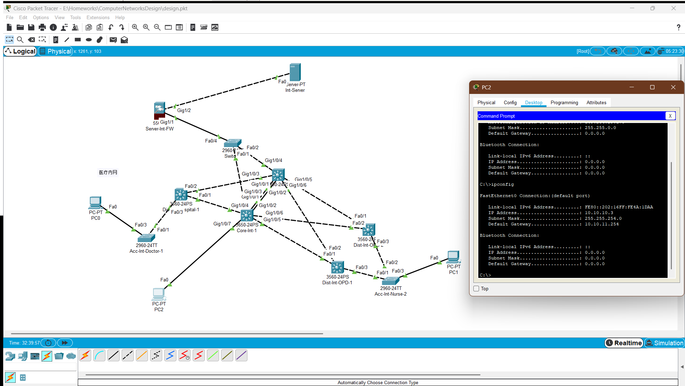

可以看到，图片中的pc2 成功获取到了dhcp分配的地址。

### 3.1.2 门诊汇聚层

#### 3.1.2.1 Core-Int-1 补充配置

```
enable
configure terminal

! ========== 1. 对接 Dist-Int-OPD-1 的接口（G1/0/3） ==========
interface GigabitEthernet1/0/3
 switchport trunk encapsulation dot1q 
 switchport mode trunk
 switchport trunk allowed vlan 10,40
 sw none
 no shutdown
exit

! ========== 2. 对接 Dist-Int-OPD-2 的接口（G1/0/4） ==========
interface GigabitEthernet1/0/4
 switchport trunk encapsulation dot1q
 switchport mode trunk
 switchport trunk allowed vlan 10,40
 sw none 
 no shutdown
exit

! ========== 3. 配置管理VLAN 40的虚拟网关（HSRP） ==========
! 核心层管理VLAN需要虚拟网关，确保汇聚层运维可达
interface Vlan40
 standby 40 ip 10.10.40.254    
 ! 管理VLAN虚拟网关（汇聚层默认网关指向此地址）
 standby 40 priority 120       
 ! Core-Int-1作为主网关
 standby 40 preempt            
 ! 抢占模式
exit

! ========== 4. 启用生成树（防环路，医院网络必备） ==========
spanning-tree mode rapid-pvst        
! 快速生成树，秒级故障切换
spanning-tree vlan 10,40 root primary 
! Core-Int-1作为VLAN10/40的主根桥

! 保存配置
exit
write memory
```

#### 3.1.2.2 Core-Int-2 补充配置

```
enable
configure terminal

! ========== 1. 对接 Dist-Int-OPD-1 的接口（G1/0/3） ==========
interface GigabitEthernet1/0/3
 switchport trunk encapsulation dot1q
 switchport mode trunk
 switchport trunk allowed vlan 10,40
 sw none
 no shutdown
exit

! ========== 2. 对接 Dist-Int-OPD-2 的接口（G1/0/4） ==========
interface GigabitEthernet1/0/4
 switchport trunk encapsulation dot1q
 switchport mode trunk
 switchport trunk allowed vlan 10,40
 sw none 
 no shutdown
exit

! ========== 3. 配置管理VLAN 40的虚拟网关（HSRP） ==========
interface Vlan40
 standby 40 ip 10.10.40.254    
 ! 和Core-Int-1一致的虚拟网关
 standby 40 priority 100       
 ! Core-Int-2作为备网关
 standby 40 preempt            
 ! 抢占模式
exit

! ========== 4. 启用生成树 ==========
spanning-tree mode rapid-pvst
spanning-tree vlan 10,40 root secondary  
! Core-Int-2作为备用根桥

! 保存配置
exit
write memory
```

#### 3.1.2.3 Dist-Int-OPD-1 配置

```
enable
configure terminal

hostname Dist-Int-OPD-1
no ip domain-lookup

vlan 10
name Doctor_Workstation
exit

vlan 40
name Management
exit

interface FastEthernet0/1
 switchport trunk encapsulation dot1q
 switchport mode trunk
 switchport trunk allowed vlan 10,40
 sw none
 no shutdown
exit

interface FastEthernet0/2
 switchport trunk encapsulation dot1q
 switchport mode trunk
 switchport trunk allowed vlan 10,40
 sw none
 no shutdown
exit

interface Vlan40
 ip address 10.10.40.5 255.255.255.0
 no shutdown
exit

ip default-gateway 10.10.40.254

interface range FastEthernet0/3 - 24
 switchport trunk encapsulation dot1q
 switchport mode trunk
 switchport trunk allowed vlan 10,40
 no shutdown
exit

spanning-tree mode rapid-pvst
exit
write memory
```

#### 3.1.2.4 Dist-Int-OPD-2 配置

```
enable
configure terminal

hostname Dist-Int-OPD-2
no ip domain-lookup

vlan 10
name Doctor_Workstation
exit

vlan 40
name Management
exit

interface FastEthernet0/1
 switchport trunk encapsulation dot1q
 switchport mode trunk
 switchport trunk allowed vlan 10,40
 sw none 
 no shutdown
exit

interface FastEthernet0/2
 switchport trunk encapsulation dot1q
 switchport mode trunk
 switchport trunk allowed vlan 10,40
 sw none 
 no shutdown
exit

interface Vlan40
 ip address 10.10.40.6 255.255.255.0
 no shutdown
exit

ip default-gateway 10.10.40.254

interface range FastEthernet0/3 - 24
 switchport trunk encapsulation dot1q
 switchport mode trunk
 switchport trunk allowed vlan 10,40
 no shutdown
exit

spanning-tree mode rapid-pvst
exit
write memory
```


#### 3.1.2.5 配置验证

```bash
! ==============Dist-Int-OPD-1 ping 核心================

Dist-Int-OPD-1#ping 10.10.40.1

Type escape sequence to abort.
Sending 5, 100-byte ICMP Echos to 10.10.40.1, timeout is 2 seconds:
!!!!!
Success rate is 100 percent (5/5), round-trip min/avg/max = 0/9/30 ms

Dist-Int-OPD-1#ping 10.10.40.2

Type escape sequence to abort.
Sending 5, 100-byte ICMP Echos to 10.10.40.2, timeout is 2 seconds:
!!!!!
Success rate is 100 percent (5/5), round-trip min/avg/max = 0/5/25 ms


Dist-Int-OPD-1#show int tr
Port        Mode         Encapsulation  Status        Native vlan
Fa0/1       on           802.1q         trunking      1
Fa0/2       on           802.1q         trunking      1
Fa0/3       on           802.1q         trunking      1
Fa0/4       on           802.1q         trunking      1

Port        Vlans allowed on trunk
Fa0/1       10,40
Fa0/2       10,40
Fa0/3       10,40
Fa0/4       10,40

Port        Vlans allowed and active in management domain
Fa0/1       10,40
Fa0/2       10,40
Fa0/3       10,40
Fa0/4       10,40

Port        Vlans in spanning tree forwarding state and not pruned
Fa0/1       10,40
Fa0/2       10
Fa0/3       10,40
Fa0/4       10,40

Dist-Int-OPD-1#show spanning-tree vlan 10
VLAN0010
  Spanning tree enabled protocol rstp
  Root ID    Priority    24586
             Address     0001.C93B.4029
             Cost        19
             Port        1(FastEthernet0/1)
             Hello Time  2 sec  Max Age 20 sec  Forward Delay 15 sec

  Bridge ID  Priority    28682  (priority 28672 sys-id-ext 10)
             Address     0001.C960.EC57
             Hello Time  2 sec  Max Age 20 sec  Forward Delay 15 sec
             Aging Time  20

Interface        Role Sts Cost      Prio.Nbr Type
---------------- ---- --- --------- -------- --------------------------------
Fa0/3            Desg FWD 19        128.3    P2p
Fa0/2            Root FWD 19        128.2    P2p
Fa0/1            Root FWD 19        128.1    P2p
Fa0/4            Desg FWD 19        128.4    P2p

Dist-Int-OPD-1#show spanning-tree vlan 40
VLAN0040
  Spanning tree enabled protocol rstp
  Root ID    Priority    24616
             Address     0001.C93B.4029
             Cost        19
             Port        1(FastEthernet0/1)
             Hello Time  2 sec  Max Age 20 sec  Forward Delay 15 sec

  Bridge ID  Priority    28712  (priority 28672 sys-id-ext 40)
             Address     0001.C960.EC57
             Hello Time  2 sec  Max Age 20 sec  Forward Delay 15 sec
             Aging Time  20

Interface        Role Sts Cost      Prio.Nbr Type
---------------- ---- --- --------- -------- --------------------------------
Fa0/3            Desg FWD 19        128.3    P2p
Fa0/2            Altn BLK 19        128.2    P2p
Fa0/1            Root FWD 19        128.1    P2p
Fa0/4            Desg FWD 19        128.4    P2p

Dist-Int-OPD-1#


Dist-Int-OPD-1#show interfaces status
Port      Name               Status       Vlan       Duplex  Speed Type
Fa0/1                        connected    1          auto    auto  10/100BaseTX
Fa0/2                        connected    1          auto    auto  10/100BaseTX
Fa0/3                        connected    1          auto    auto  10/100BaseTX
Fa0/4                        connected    1          auto    auto  10/100BaseTX
Fa0/5                        notconnect   1          auto    auto  10/100BaseTX
Fa0/6                        notconnect   1          auto    auto  10/100BaseTX
Fa0/7                        notconnect   1          auto    auto  10/100BaseTX
Fa0/8                        notconnect   1          auto    auto  10/100BaseTX
Fa0/9                        notconnect   1          auto    auto  10/100BaseTX
Fa0/10                       notconnect   1          auto    auto  10/100BaseTX
Fa0/11                       notconnect   1          auto    auto  10/100BaseTX
Fa0/12                       notconnect   1          auto    auto  10/100BaseTX
Fa0/13                       notconnect   1          auto    auto  10/100BaseTX
Fa0/14                       notconnect   1          auto    auto  10/100BaseTX
Fa0/15                       notconnect   1          auto    auto  10/100BaseTX
Fa0/16                       notconnect   1          auto    auto  10/100BaseTX
Fa0/17                       notconnect   1          auto    auto  10/100BaseTX
Fa0/18                       notconnect   1          auto    auto  10/100BaseTX
Fa0/19                       notconnect   1          auto    auto  10/100BaseTX
Fa0/20                       notconnect   1          auto    auto  10/100BaseTX
Fa0/21                       notconnect   1          auto    auto  10/100BaseTX
Fa0/22                       notconnect   1          auto    auto  10/100BaseTX
Fa0/23                       notconnect   1          auto    auto  10/100BaseTX
Fa0/24                       notconnect   1          auto    auto  10/100BaseTX
Gig0/1                       notconnect   1          auto    auto  10/100BaseTX
Gig0/2                       notconnect   1          auto    auto  10/100BaseTX

Dist-Int-OPD-1#
Dist-Int-OPD-1#


Dist-Int-OPD-1#ping 10.10.11.254

Type escape sequence to abort.
Sending 5, 100-byte ICMP Echos to 10.10.11.254, timeout is 2 seconds:
!!!!!
Success rate is 100 percent (5/5), round-trip min/avg/max = 0/18/37 ms

Dist-Int-OPD-1#
```

验证dhcp

```
!Dist-Int-OPD-1
conf t
int fa 0/5
sw mode acc
sw acc vlan 10
no sh
exit
```

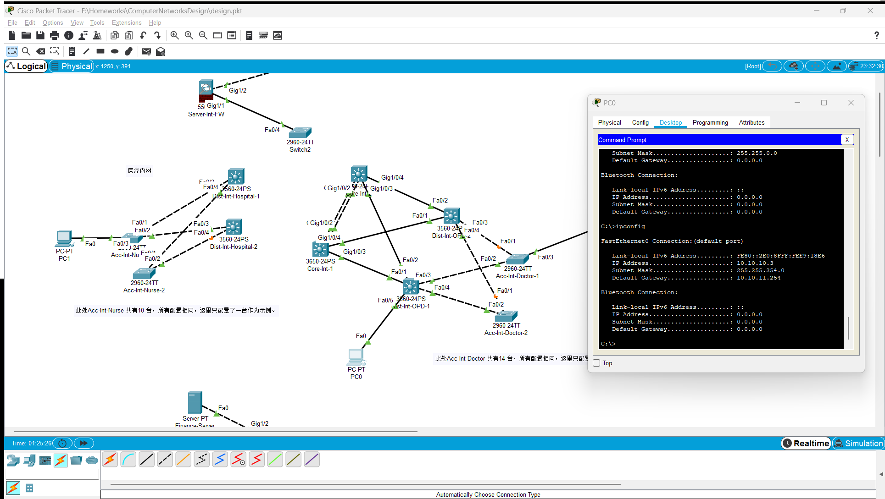


### 3.1.3 门诊接入层

#### 3.1.3.1 Acc-Int-Doctor-1

```
enable
configure terminal

! 基础配置
hostname Acc-Int-Doctor-1
no ip domain-lookup

! 创建业务VLAN和管理VLAN
vlan 10
 name Doctor_Workstation
exit
vlan 40
 name Management
exit

! ========== 上联 Dist-Int-OPD-1（Fa0/3） ==========
interface FastEthernet0/1
 switchport mode trunk
 switchport trunk allowed vlan 10,40  
 no shutdown
exit

! ========== 上联 Dist-Int-OPD-2（Fa0/3） ==========
interface FastEthernet0/2
 switchport mode trunk
 switchport trunk allowed vlan 10,40
 no shutdown
exit

! ========== 管理VLAN配置（运维用） ==========
interface Vlan40
 ip address 10.10.40.7 255.255.255.0  
 no shutdown
exit

! 管理网关指向核心虚拟网关
ip default-gateway 10.10.40.254

! ========== 下联医生工作站PC（所有终端接口） ==========
interface range FastEthernet0/3 - 24
 switchport mode access 
 switchport access vlan 10
 no shutdown
exit

! ========== 生成树（防环路，冗余必备） ==========
spanning-tree mode rapid-pvst

! 保存配置
exit
write memory
```


#### 3.1.3.2 配置验证

```
Acc-Int-Doctor-1#show int trunk
Port        Mode         Encapsulation  Status        Native vlan
Fa0/1       on           802.1q         trunking      1
Fa0/2       on           802.1q         trunking      1

Port        Vlans allowed on trunk
Fa0/1       10,40
Fa0/2       10,40

Port        Vlans allowed and active in management domain
Fa0/1       10,40
Fa0/2       10,40

Port        Vlans in spanning tree forwarding state and not pruned
Fa0/1       40
Fa0/2       none

Acc-Int-Doctor-1#
```

Fa 0/2 是防止环路的行为，none是正常的结果

dhcp ip获取正常

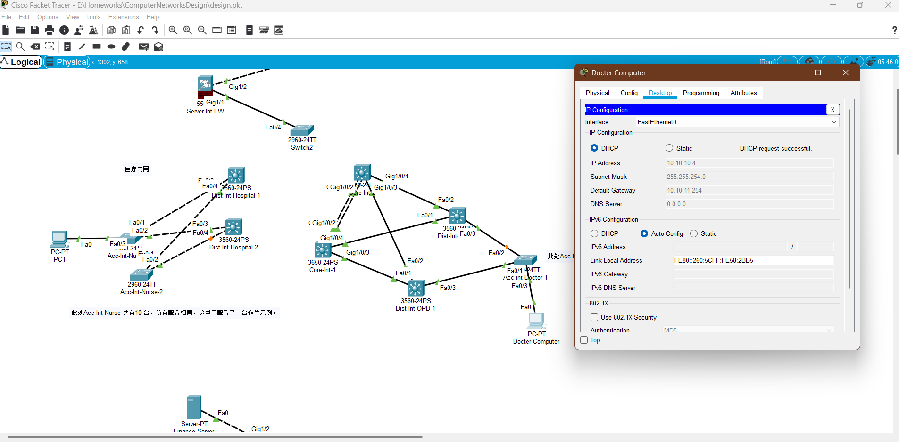

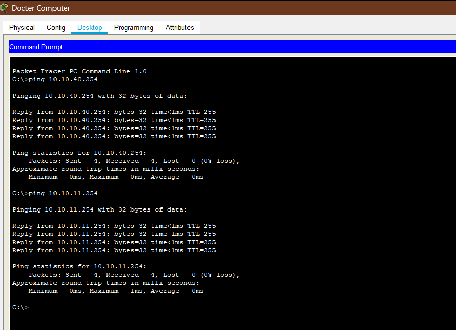

网关均能ping通

### 3.1.4 护士工作站汇聚层
#### 3.1.4.1 Core-Int-1 补充配置（对接护士汇聚层）
```
enable
configure terminal

! ========== 1. 对接 Dist-Int-Hospital-1 的接口（G1/0/5） ==========
interface GigabitEthernet1/0/5
 switchport trunk encapsulation dot1q 
 switchport mode trunk
 switchport trunk allowed vlan 20,40
 sw none 
 no shutdown
exit

! ========== 2. 对接 Dist-Int-Hospital-2 的接口（G1/0/6） ==========
interface GigabitEthernet1/0/6
 switchport trunk encapsulation dot1q
 switchport mode trunk
 switchport trunk allowed vlan 20,40
 sw none 
 no shutdown
exit

! ========== 3. 生成树强化配置（护士VLAN 20） ==========
spanning-tree vlan 20 root primary  
! Core-Int-1作为VLAN20主根桥

! 保存配置
exit
write memory
```

#### 3.1.4.2 Core-Int-2 补充配置（对接护士汇聚层）
```
enable
configure terminal

! ========== 1. 对接 Dist-Int-Hospital-1 的接口（G1/0/5） ==========
interface GigabitEthernet1/0/5
 switchport trunk encapsulation dot1q
 switchport mode trunk
 switchport trunk allowed vlan 20,40
 no shutdown
exit

! ========== 2. 对接 Dist-Int-Hospital-2 的接口（G1/0/6） ==========
interface GigabitEthernet1/0/6
 switchport trunk encapsulation dot1q
 switchport mode trunk
 switchport trunk allowed vlan 20,40
 no shutdown
exit

! ========== 3. 生成树强化配置（护士VLAN 20） ==========
spanning-tree vlan 20 root secondary  
! Core-Int-2作为VLAN20备用根桥

! 保存配置
exit
write memory
```

#### 3.1.4.3 Dist-Int-Hospital-1 配置（护士汇聚层1）
```
enable
configure terminal

hostname Dist-Int-Hospital-1
no ip domain-lookup

vlan 20
name Nurse_Workstation
exit

vlan 40
name Management
exit

interface FastEthernet0/1
 switchport trunk encapsulation dot1q
 switchport mode trunk
 switchport trunk allowed vlan 20,40
 sw none 
 no shutdown
exit

interface FastEthernet0/2
 switchport trunk encapsulation dot1q
 switchport mode trunk
 switchport trunk allowed vlan 20,40
 sw none
 no shutdown
exit

interface Vlan40
 ip address 10.10.40.3 255.255.255.0
 no shutdown
exit

ip default-gateway 10.10.40.254

interface range FastEthernet0/3 - 24
 switchport trunk encapsulation dot1q
 switchport mode trunk
 switchport trunk allowed vlan 20,40
 no shutdown
exit

spanning-tree mode rapid-pvst
exit
write memory
```

#### 3.1.4.4 Dist-Int-Hospital-2 配置（护士汇聚层2）
```
enable
configure terminal

hostname Dist-Int-Hospital-2
no ip domain-lookup

vlan 20
name Nurse_Workstation
exit

vlan 40
name Management
exit

interface FastEthernet0/1
 switchport trunk encapsulation dot1q
 switchport mode trunk
 switchport trunk allowed vlan 20,40
 sw none
 no shutdown
exit

interface FastEthernet0/2
 switchport trunk encapsulation dot1q
 switchport mode trunk
 switchport trunk allowed vlan 20,40
 sw none
 no shutdown
exit

interface Vlan40
 ip address 10.10.40.4 255.255.255.0
 no shutdown
exit

ip default-gateway 10.10.40.254

interface range FastEthernet0/3 - 24
 switchport trunk encapsulation dot1q
 switchport mode trunk
 switchport trunk allowed vlan 20,40
 no shutdown
exit

spanning-tree mode rapid-pvst
exit
write memory
```

#### 3.1.4.5 配置验证

```
Core-Int-1#show interfaces trunk
Port        Mode         Encapsulation  Status        Native vlan
Po1         on           802.1q         trunking      1
Gig1/0/3    on           802.1q         trunking      1
Gig1/0/4    on           802.1q         trunking      1
Gig1/0/5    on           802.1q         trunking      1
Gig1/0/6    on           802.1q         trunking      1

Port        Vlans allowed on trunk
Po1         1-1005
Gig1/0/3    10,40
Gig1/0/4    10,40
Gig1/0/5    20,40
Gig1/0/6    20,40

Port        Vlans allowed and active in management domain
Po1         1,10,20,30,40
Gig1/0/3    10,40
Gig1/0/4    10,40
Gig1/0/5    20,40
Gig1/0/6    20,40

Port        Vlans in spanning tree forwarding state and not pruned
Po1         1,10,20,30,40
Gig1/0/3    10,40
Gig1/0/4    10,40
Gig1/0/5    20,40
Gig1/0/6    20,40

Core-Int-1#show spanning-tree vlan 20
VLAN0020
  Spanning tree enabled protocol rstp
  Root ID    Priority    24596
             Address     0001.C93B.4029
             This bridge is the root
             Hello Time  2 sec  Max Age 20 sec  Forward Delay 15 sec

  Bridge ID  Priority    24596  (priority 24576 sys-id-ext 20)
             Address     0001.C93B.4029
             Hello Time  2 sec  Max Age 20 sec  Forward Delay 15 sec
             Aging Time  20

Interface        Role Sts Cost      Prio.Nbr Type
---------------- ---- --- --------- -------- --------------------------------
Gi1/0/4          Desg FWD 19        128.4    P2p
Gi1/0/3          Desg FWD 19        128.3    P2p
Gi1/0/5          Desg FWD 19        128.5    P2p
Gi1/0/6          Desg FWD 19        128.6    P2p
Po1              Desg FWD 3         128.29   Shr
```

```
Dist-Int-Hospital-1#show interfaces trunk
Port        Mode         Encapsulation  Status        Native vlan
Fa0/1       on           802.1q         trunking      1
Fa0/2       on           802.1q         trunking      1
Fa0/3       on           802.1q         trunking      1

Port        Vlans allowed on trunk
Fa0/1       20,40
Fa0/2       20,40
Fa0/3       20,40

Port        Vlans allowed and active in management domain
Fa0/1       20,40
Fa0/2       20,40
Fa0/3       20,40

Port        Vlans in spanning tree forwarding state and not pruned
Fa0/1       20,40
Fa0/2       none
Fa0/3       20,40

Dist-Int-Hospital-1#ping 10.10.40.254

Type escape sequence to abort.
Sending 5, 100-byte ICMP Echos to 10.10.40.254, timeout is 2 seconds:
!!!!!
Success rate is 100 percent (5/5), round-trip min/avg/max = 0/0/0 ms

Dist-Int-Hospital-1#ping 10.10.20.254

Type escape sequence to abort.
Sending 5, 100-byte ICMP Echos to 10.10.20.254, timeout is 2 seconds:
!!!!!
Success rate is 100 percent (5/5), round-trip min/avg/max = 0/0/0 ms

Dist-Int-Hospital-1#ping 10.10.40.1

Type escape sequence to abort.
Sending 5, 100-byte ICMP Echos to 10.10.40.1, timeout is 2 seconds:
!!!!!
Success rate is 100 percent (5/5), round-trip min/avg/max = 0/0/1 ms
```

### 3.1.5 护士工作站接入层
#### 3.1.5.1 Acc-Int-Nurse-1
```
enable
configure terminal

! 基础配置
hostname Acc-Int-Nurse-1
no ip domain-lookup

! 创建业务VLAN和管理VLAN
vlan 20
 name Nurse_Workstation
exit
vlan 40
 name Management
exit

! ========== 上联 Dist-Int-Hospital-1（Fa0/3） ==========
interface FastEthernet0/1
 switchport mode trunk
 switchport trunk allowed vlan 20,40  
 no shutdown
exit

! ========== 上联 Dist-Int-Hospital-2（Fa0/3） ==========
interface FastEthernet0/2
 switchport mode trunk
 switchport trunk allowed vlan 20,40
 no shutdown
exit

! ========== 管理VLAN配置（运维用） ==========
interface Vlan40
 ip address 10.10.40.21 255.255.255.0  
 no shutdown
exit

! 管理网关指向核心虚拟网关
ip default-gateway 10.10.40.254

! ========== 下联护士工作站PC（所有终端接口） ==========
interface range FastEthernet0/3 - 24
 switchport mode access 
 switchport access vlan 20
 no shutdown
exit

! ========== 生成树（防环路，冗余必备） ==========
spanning-tree mode rapid-pvst

! 保存配置
exit
write memory
```

#### 3.1.5.2 快速验证命令（配置后执行）

```bash
Acc-Int-Nurse-1#show interfaces trunk
Port        Mode         Encapsulation  Status        Native vlan
Fa0/1       on           802.1q         trunking      1
Fa0/2       on           802.1q         trunking      1

Port        Vlans allowed on trunk
Fa0/1       20,40
Fa0/2       20,40

Port        Vlans allowed and active in management domain
Fa0/1       20,40
Fa0/2       20,40

Port        Vlans in spanning tree forwarding state and not pruned
Fa0/1       20,40
Fa0/2       none

Acc-Int-Nurse-1#show ip interface brief | include Vlan40
Vlan40                 10.10.40.21     YES manual up                    up


Acc-Int-Nurse-1#show interfaces FastEthernet0/3 switchport | include Access Mode VLAN
Access Mode VLAN: 20 (Nurse_Workstation)

```

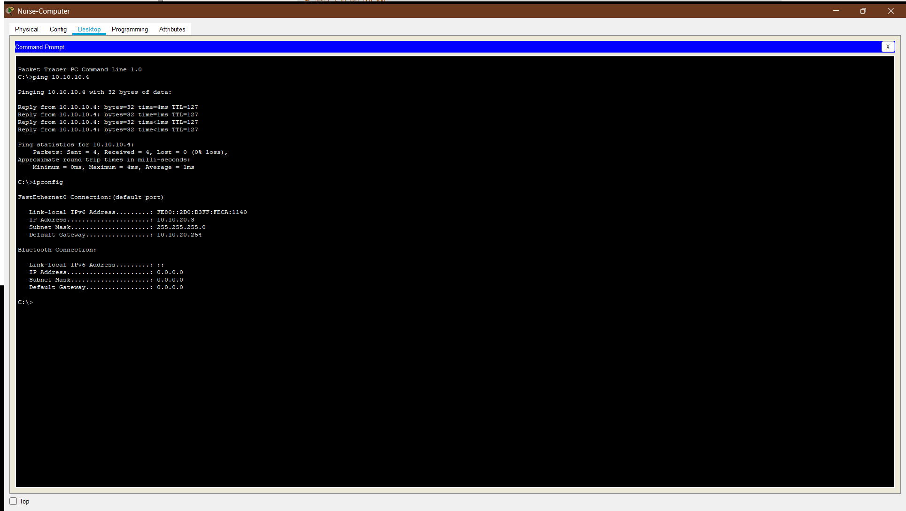

护士电脑能正确入网，dhcp获取ip地址，并能正确地和医生通讯


### 3.1.6 服务器

#### 3.1.6.1 Core-Int-1 补充配置

```
enable
configure terminal

! 对接防火墙GigabitEthernet1/1的接口（G1/0/7）
interface GigabitEthernet1/0/7
 switchport trunk encapsulation dot1q
 switchport mode trunk
 switchport trunk allowed vlan 30,40 
 no shutdown
exit

! VLAN30主根桥（服务器网段生成树主节点）
spanning-tree vlan 30 root primary

! 保存配置
exit
write memory
```

#### 3.1.6.2 Core-Int-2 补充配置

```
enable
configure terminal

! 对接防火墙GigabitEthernet1/2的接口（G1/0/7）
interface GigabitEthernet1/0/7
 switchport trunk encapsulation dot1q
 switchport mode trunk
 switchport trunk allowed vlan 30,40
 no shutdown
exit

! VLAN30备用根桥（核心故障时自动切换）
spanning-tree vlan 30 root secondary

! 保存配置

exit
write memory
```

#### 3.1.6.3 Server-Int-Switch

```
! 进入特权模式
enable
configure terminal

hostname Server-Int-Switch
no ip domain-lookup

! ===================== 2. VLAN配置（匹配医疗内网规划） =====================
! 医疗服务器业务VLAN
vlan 30
 name Medical_Server
exit

! 设备管理VLAN（与核心/防火墙统一）
vlan 40
 name Management
exit

! ===================== 3. 上联核心交换机接口配置（冗余连通） =====================
! Fa0/1 对接 Core-Int-1 的 G1/0/7
interface FastEthernet0/1
 switchport mode trunk 

 switchport trunk allowed vlan 30,40
 no shutdown
exit

! Fa0/2 对接 Core-Int-2 的 G1/0/7（冗余备份）
interface FastEthernet0/2
 switchport mode trunk
 switchport trunk allowed vlan 30,40
 no shutdown
exit

! ===================== 4. 服务器接入端口配置（核心接入） =====================
interface range FastEthernet0/3 - 24
 switchport mode access
 switchport access vlan 30
 spanning-tree portfast
 no shutdown
exit

! ===================== 5. 管理VLAN配置（保障设备运维） =====================
interface Vlan40
 ip address 10.10.40.32 255.255.255.0
 no shutdown
exit

! 默认网关（指向核心层VRRP虚拟网关，保障冗余）
ip default-gateway 10.10.40.254

! ===================== 6. 生成树配置（防环路，保障冗余） =====================
spanning-tree mode rapid-pvst
spanning-tree vlan 30,40 priority 24576

! ===================== 7. 保存配置（防止丢失） =====================
exit
write memory
```

#### 3.1.6.3 测试配置

```
Server-Int-Switch#ping 10.10.40.254

Type escape sequence to abort.
Sending 5, 100-byte ICMP Echos to 10.10.40.254, timeout is 2 seconds:
!!!!!
Success rate is 100 percent (5/5), round-trip min/avg/max = 0/0/1 ms

Server-Int-Switch#
```

服务器ping网关

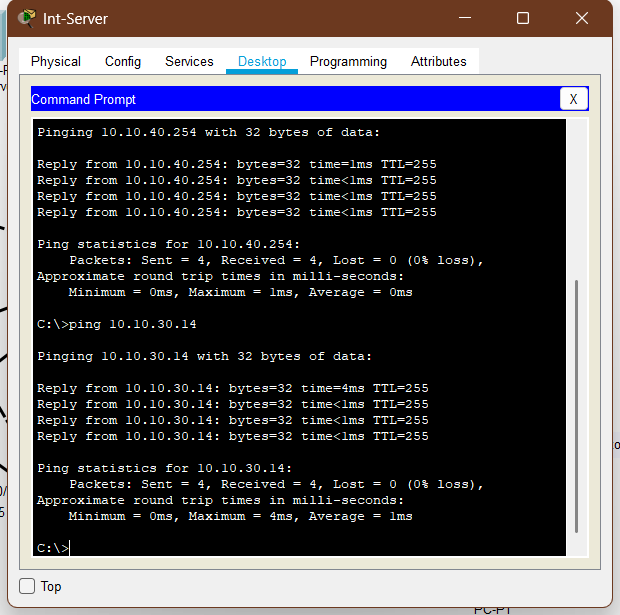

护士电脑ping服务器

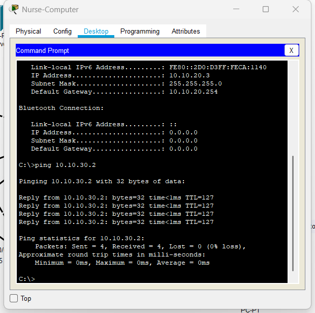

### 3.1.7 核心服务器配置acl

#### 3.1.7.1 Core-Int-1

```
enable
configure terminal

! ========== 1. 定义极简ACL（放行所有IP流量） ==========
ip access-list extended MEDICAL_SERVER_ACL
 permit ip any any 
exit

! ========== 2. 应用到服务器VLAN三层接口（Vlan30） ==========
interface Vlan30
 ip access-group MEDICAL_SERVER_ACL in
exit

! ========== 3. 保存配置 ==========
exit
write memory
```

#### 3.1.7.2 Core-Int-2

```
enable
configure terminal

! ========== 1. 同步极简ACL配置 ==========
ip access-list extended MEDICAL_SERVER_ACL
 permit ip any any
exit

! ========== 2. 应用到Vlan30接口 ==========
interface Vlan30
 ip access-group MEDICAL_SERVER_ACL in
exit

! ========== 3. 保存配置 ==========
exit
write memory
```

## 3.2 政务外网

### 3.2.1 核心层配置

#### 3.2.1.1 Core-Ext-1 

```
enable
configure terminal

hostname Core-Ext-1
no ip domain-lookup 

! 创建办公外网相关VLAN
vlan 210
 name Admin_Office
exit
vlan 220
 name Ext_Router
exit
vlan 230
 name Finance_Server
exit
vlan 240
 name Guest_Wireless
exit
vlan 40
 name Management
exit
vlan 50
 name AP_Management_Ext
exit

! 双核心互联 - 链路聚合配置
interface range GigabitEthernet1/0/1 - 2
 switchport trunk encapsulation dot1q
 switchport mode trunk
 channel-group 1 mode active
 no shutdown
exit

interface Port-channel1
 switchport trunk encapsulation dot1q
 switchport mode trunk
 switchport trunk allowed vlan all
 no shutdown
exit

! 管理VLAN配置
interface Vlan40
 ip address 10.10.40.33 255.255.255.0
 no shutdown
 standby 40 ip 10.10.40.254
 standby 40 priority 120
 standby 40 preempt
exit

! AP管理VLAN配置（办公外网AP）
interface Vlan50
 ip address 10.10.50.1 255.255.255.0
 no shutdown
 standby 50 ip 10.10.50.254
 standby 50 priority 120
 standby 50 preempt
exit

! ========== VLAN 210（行政办公电脑）- VRRP 配置 ==========
interface Vlan210
ip address 10.10.210.1 255.255.255.0
no shutdown
standby 210 ip 10.10.210.254
standby 210 priority 120 
standby 210 preempt
exit

! ========== VLAN 220（外网路由器）- VRRP 配置 ==========
interface Vlan220
 ip address 10.10.220.1 255.255.255.240
 no shutdown
 standby 220 ip 10.10.220.14
 standby 220 priority 120
 standby 220 preempt
exit

! ========== VLAN 230（财务行政服务器）- VRRP 配置 ==========
interface Vlan230
 ip address 10.10.230.1 255.255.255.240
 no shutdown
 standby 230 ip 10.10.230.14
 standby 230 priority 120
 standby 230 preempt
exit

! ========== VLAN 240（客户病房无线网络）- VRRP 配置 ==========
interface Vlan240
 ip address 10.20.0.1 255.255.240.0
 no shutdown
 standby 240 ip 10.20.15.254
 standby 240 priority 120
 standby 240 preempt
exit

! 启用三层路由
ip routing

! DHCP配置 - VLAN210行政办公
service dhcp
ip dhcp pool VLAN210-Admin
network 10.10.210.0 255.255.255.0  
default-router 10.10.210.254
ip dhcp excluded-address 10.10.210.1
ip dhcp excluded-address 10.10.210.2
ip dhcp excluded-address 10.10.210.3
ip dhcp excluded-address 10.10.210.254

! DHCP配置 - VLAN240访客无线
ip dhcp pool VLAN240-Guest
network 10.20.0.0 255.255.240.0
default-router 10.20.15.254

ip dhcp excluded-address 10.20.0.1
ip dhcp excluded-address 10.20.0.2
ip dhcp excluded-address 10.20.15.254
ip dhcp excluded-address 10.20.15.253


! 生成树配置
spanning-tree mode rapid-pvst        
spanning-tree vlan 210,220,230,240,50 root primary 

! 保存配置
exit
write memory
```

#### 3.2.1.2 Core-Ext-2

```
enable
configure terminal

hostname Core-Ext-2
no ip domain-lookup

! 创建办公外网相关VLAN
vlan 210
 name Admin_Office
exit
vlan 220
 name Ext_Router
exit
vlan 230
 name Finance_Server
exit
vlan 240
 name Guest_Wireless
exit
vlan 40
 name Management
exit
vlan 50
 name AP_Management_Ext
exit

! 双核心互联 - 链路聚合配置
interface range GigabitEthernet1/0/1 - 2
 switchport trunk encapsulation dot1q
 switchport mode trunk
 channel-group 1 mode active
 no shutdown
exit

interface Port-channel1
 switchport trunk encapsulation dot1q
 switchport mode trunk
 no shutdown
exit

! 管理VLAN配置
interface Vlan40
 ip address 10.10.40.34 255.255.255.0
 no shutdown
 standby 40 ip 10.10.40.254
 standby 40 priority 100
 standby 40 preempt
exit

! AP管理VLAN配置（办公外网AP）
interface Vlan50
 ip address 10.10.50.2 255.255.255.0
 no shutdown
 standby 50 ip 10.10.50.254
 standby 50 priority 100
 standby 50 preempt
exit

! ========== VLAN 210（行政办公电脑）- VRRP 配置（备核心） ==========
interface Vlan210
 ip address 10.10.210.2 255.255.255.0
 no shutdown
 standby 210 ip 10.10.210.254
 standby 210 priority 100
 standby 210 preempt
exit

! ========== VLAN 220（外网路由器）- VRRP 配置（备核心） ==========
interface Vlan220
 ip address 10.10.220.2 255.255.255.240
 no shutdown
 standby 220 ip 10.10.220.14
 standby 220 priority 100
 standby 220 preempt
exit

! ========== VLAN 230（财务行政服务器）- VRRP 配置（备核心） ==========
interface Vlan230
 ip address 10.10.230.2 255.255.255.240
 no shutdown
 standby 230 ip 10.10.230.14
 standby 230 priority 100
 standby 230 preempt
exit

! ========== VLAN 240（客户病房无线网络）- VRRP 配置（备核心） ==========
interface Vlan240
 ip address 10.20.0.2 255.255.240.0
 no shutdown
 standby 240 ip 10.20.15.254
 standby 240 priority 100
 standby 240 preempt
exit

! 启用三层路由
ip routing

! DHCP备用地址池配置
ip dhcp pool VLAN210-Admin-Backup
 network 10.10.210.0 255.255.255.0
 default-router 10.10.210.254

ip dhcp excluded-address 10.10.210.1
ip dhcp excluded-address 10.10.210.2
ip dhcp excluded-address 10.10.210.3
ip dhcp excluded-address 10.10.210.254

ip dhcp pool VLAN240-Guest-Backup
 network 10.20.0.0 255.255.240.0
 default-router 10.20.15.254

ip dhcp excluded-address 10.20.0.1
ip dhcp excluded-address 10.20.0.2
ip dhcp excluded-address 10.20.15.254
ip dhcp excluded-address 10.20.15.253

! DHCP中继配置
interface Vlan210
 ip helper-address 10.10.210.1
exit
interface Vlan240
 ip helper-address 10.20.0.1
exit

! 生成树配置
spanning-tree mode rapid-pvst
spanning-tree vlan 210,220,230,240,50 root secondary  

! 保存配置
exit
write memory
```


#### 3.2.1.3 配置验证

使用g 1/0/24测试

```
en
conf t
int g 1/0/4
sw mode acc
sw acc vlan 210
no sh
exit

```

### 3.2.2 行政办公汇聚层配置

#### 3.2.2.1 Core-Ext-1 补充配置

```
enable
configure terminal

! ========== 1. 对接 Dist-Ext-Admin-1 的接口（G1/0/3） ==========
interface GigabitEthernet1/0/3
 switchport trunk encapsulation dot1q 
 switchport mode trunk
 switchport trunk allowed vlan 210,40
 switchport nonegotiate
 no shutdown
exit

! ========== 2. 对接 Dist-Ext-Admin-2 的接口（G1/0/4） ==========
interface GigabitEthernet1/0/4
 switchport trunk encapsulation dot1q
 switchport mode trunk
 switchport trunk allowed vlan 210,40
 switchport nonegotiate
 no shutdown
exit

! ========== 3. 配置管理VLAN 40的虚拟网关（VRRP） ==========
! 办公外网核心层管理VLAN虚拟网关，汇聚层默认网关指向此地址
interface Vlan40
 standby 40 ip 10.10.40.254    
 ! 管理VLAN虚拟网关统一为10.10.40.254
 standby 40 priority 120       
 ! Core-Ext-1作为主网关
 standby 40 preempt            
 ! 抢占模式，确保主网关故障恢复后切回
exit

! ========== 4. 启用生成树（防环路，办公外网必备） ==========
spanning-tree mode rapid-pvst        
! 快速生成树，秒级故障切换
spanning-tree vlan 210,40 root primary 
! Core-Ext-1作为VLAN210（行政办公）/40的主根桥

! 保存配置
exit
write memory
```

#### 3.2.2.2 Core-Ext-2 补充配置

```
enable
configure terminal

! ========== 1. 对接 Dist-Ext-Admin-1 的接口（G1/0/3） ==========
interface GigabitEthernet1/0/3
 switchport trunk encapsulation dot1q
 switchport mode trunk
 switchport trunk allowed vlan 210,40
 switchport nonegotiate
 no shutdown
exit

! ========== 2. 对接 Dist-Ext-Admin-2 的接口（G1/0/4） ==========
interface GigabitEthernet1/0/4
 switchport trunk encapsulation dot1q
 switchport mode trunk
 switchport trunk allowed vlan 210,40
 switchport nonegotiate
 no shutdown
exit

! ========== 3. 配置管理VLAN 40的虚拟网关（VRRP） ==========
interface Vlan40
 standby 40 ip 10.10.40.254    
 ! 和Core-Ext-1一致的虚拟网关
 standby 40 priority 100       
 ! Core-Ext-2作为备网关
 standby 40 preempt            
 ! 抢占模式
exit

! ========== 4. 启用生成树 ==========
spanning-tree mode rapid-pvst
spanning-tree vlan 210,40 root secondary  
! Core-Ext-2作为VLAN210/40的备用根桥

! 保存配置
exit
write memory
```

#### 3.2.2.3 Dist-Ext-Admin-1

```
enable
configure terminal

hostname Dist-Ext-Admin-1
no ip domain-lookup

! 创建业务VLAN和管理VLAN
vlan 210
 name Admin_Workstation
exit
vlan 40
 name Management
exit

! ========== 上联 Core-Ext-1 的接口（Fa0/1） ==========
interface FastEthernet0/1
 switchport trunk encapsulation dot1q
 switchport mode trunk
 switchport trunk allowed vlan 210,40
 switchport nonegotiate
 no shutdown
exit

! ========== 上联 Core-Ext-2 的接口（Fa0/2） ==========
interface FastEthernet0/2
 switchport trunk encapsulation dot1q
 switchport mode trunk
 switchport trunk allowed vlan 210,40
 switchport nonegotiate
 no shutdown
exit

! ========== 管理VLAN配置（运维用） ==========
interface Vlan40
 ip address 10.10.40.35 255.255.255.0
 no shutdown
exit

! 管理网关指向核心层虚拟网关
ip default-gateway 10.10.40.254

! ========== 下联行政接入交换机接口（Fa0/3 - 24） ==========
interface range FastEthernet0/3 - 24
 switchport trunk encapsulation dot1q
 switchport mode trunk
 switchport trunk allowed vlan 210,40
 no shutdown
exit

! ========== 生成树配置 ==========
spanning-tree mode rapid-pvst

! 保存配置
exit
write memory
```

#### 3.2.2.4 Dist-Ext-Admin-2

```
enable
configure terminal

hostname Dist-Ext-Admin-2
no ip domain-lookup

! 创建业务VLAN和管理VLAN
vlan 210
 name Admin_Workstation
exit
vlan 40
 name Management
exit

! ========== 上联 Core-Ext-1 的接口（Fa0/1） ==========
interface FastEthernet0/1
 switchport trunk encapsulation dot1q
 switchport mode trunk
 switchport trunk allowed vlan 210,40
 switchport nonegotiate
 no shutdown
exit

! ========== 上联 Core-Ext-2 的接口（Fa0/2） ==========
interface FastEthernet0/2
 switchport trunk encapsulation dot1q
 switchport mode trunk
 switchport trunk allowed vlan 210,40
 switchport nonegotiate
 no shutdown
exit

! ========== 管理VLAN配置（运维用） ==========
interface Vlan40
 ip address 10.10.40.36 255.255.255.0
 no shutdown
exit

! 管理网关指向核心层虚拟网关
ip default-gateway 10.10.40.254

! ========== 下联行政接入交换机接口（Fa0/3 - 24） ==========
interface range FastEthernet0/3 - 24
 switchport trunk encapsulation dot1q
 switchport mode trunk
 switchport trunk allowed vlan 210,40
 no shutdown
exit

! ========== 生成树配置 ==========
spanning-tree mode rapid-pvst

! 保存配置
exit
write memory
```

#### 3.2.2.5 配置验证

断开Dist-Ext-Admin与Core-Ext-1之间的连接后，仍然能ping通

```
Dist-Ext-Admin-1#ping 10.10.40.36

Type escape sequence to abort.
Sending 5, 100-byte ICMP Echos to 10.10.40.36, timeout is 2 seconds:
!!!!!
Success rate is 100 percent (5/5), round-trip min/avg/max = 0/0/0 ms

Dist-Ext-Admin-1#ping 10.10.40.33

Type escape sequence to abort.
Sending 5, 100-byte ICMP Echos to 10.10.40.33, timeout is 2 seconds:
.!!!!
Success rate is 80 percent (4/5), round-trip min/avg/max = 0/0/1 ms

Dist-Ext-Admin-1#ping 10.10.40.34

Type escape sequence to abort.
Sending 5, 100-byte ICMP Echos to 10.10.40.34, timeout is 2 seconds:
.!!!!
Success rate is 80 percent (4/5), round-trip min/avg/max = 0/0/1 ms

Dist-Ext-Admin-1#ping 10.10.40.254

Type escape sequence to abort.
Sending 5, 100-byte ICMP Echos to 10.10.40.254, timeout is 2 seconds:
.!!!!
Success rate is 80 percent (4/5), round-trip min/avg/max = 0/0/0 ms

Dist-Ext-Admin-1#
```

### 3.2.3 行政办公接入层

#### 3.2.3.1 Acc-Ext-Office-1

```
enable
configure terminal

! 基础配置
hostname Acc-Ext-Office-1
no ip domain-lookup

! 创建业务VLAN和管理VLAN
vlan 210
 name Admin_Workstation
exit
vlan 40
 name Management
exit

! ========== 上联 Dist-Ext-Admin-1（Fa0/3） ==========
interface FastEthernet0/1
 switchport mode trunk
 switchport trunk allowed vlan 210,40  
 no shutdown
exit

! ========== 上联 Dist-Ext-Admin-2（Fa0/3） ==========
interface FastEthernet0/2
 switchport mode trunk
 switchport trunk allowed vlan 210,40
 no shutdown
exit

! ========== 管理VLAN配置（运维用） ==========
interface Vlan40
 ip address 10.10.40.37 255.255.255.0  
 ! 接入层管理地址，按清单分配为10.10.40.37
 no shutdown
exit

! 管理网关指向核心层虚拟网关
ip default-gateway 10.10.40.254

! ========== 下联终端接口配置 ==========
! Fa0/3 专用于管理电脑PC5（静态绑定，区分普通办公终端）
interface FastEthernet0/3
 switchport mode access 
 switchport access vlan 210
 no shutdown
 ! 可选：配置端口安全，仅允许PC5的MAC地址接入（增强安全性）
 switchport port-security
 switchport port-security maximum 1
 switchport port-security violation restrict
 switchport port-security mac-address sticky  
 ! 自动绑定接入设备MAC（也可手动指定PC5的MAC）
exit

! Fa0/4 - 24 为普通行政办公终端接口（动态DHCP分配）
interface range FastEthernet0/4 - 24
 switchport mode access 
 switchport access vlan 210
 no shutdown
 ! 基础端口安全（可选）
 switchport port-security
 switchport port-security maximum 1
 switchport port-security violation restrict
exit

! ========== 生成树配置（防环路，冗余必备） ==========
spanning-tree mode rapid-pvst
! 优化接入层生成树（可选，加速终端接入）
spanning-tree portfast default

! 保存配置
exit
write memory
```

#### 3.2.3.2 配置验证

管理员ip 10.10.210.3

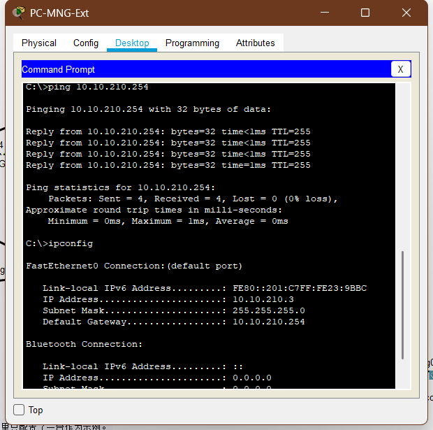

dhcp

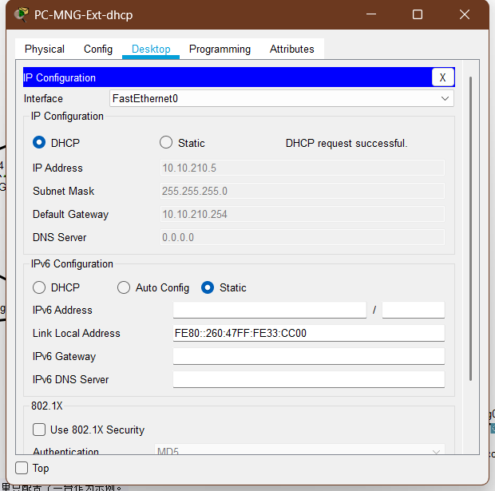

### 3.2.4 服务器

#### 3.2.4.1 Switch-Ext-Server

```
enable
configure terminal

! 基础配置
hostname Switch-Ext-Server
no ip domain-lookup 

! 创建业务VLAN和管理VLAN
vlan 230
 name Finance_Admin_Server
exit
vlan 40
 name Management
exit

! ========== 上联 Core-Ext-1（Fa0/1） ==========
interface FastEthernet0/1

 switchport mode trunk
 switchport trunk allowed vlan 40,230
 no shutdown
exit

! ========== 上联 Core-Ext-2（Fa0/2） ==========
interface FastEthernet0/2
 switchport mode trunk
 switchport trunk allowed vlan 40,230
 no shutdown
exit

! ========== 管理VLAN配置（运维用） ==========
interface Vlan40
 ip address 10.10.40.56 255.255.255.0
 no shutdown
exit

! 管理网关指向核心层管理VLAN虚拟网关
ip default-gateway 10.10.40.254

! ========== 下联财务行政服务器（终端接口） ==========
interface range FastEthernet0/3 - 24
 switchport mode access
 switchport access vlan 230
 no shutdown
exit

! ========== 生成树配置（防环路，冗余必备） ==========
spanning-tree mode rapid-pvst
no spanning-tree portfast default
no spanning-tree portfast bpduguard default
spanning-tree vlan 230,40 priority 24576

exit
write memory 
```

#### 3.2.4.2 Core-Ext-1 补充配置

```
enable
configure terminal

! 对接Switch-Ext-Server的G1/0/5接口
interface GigabitEthernet1/0/5
 switchport trunk encapsulation dot1q
 switchport mode trunk
 switchport nonegotiate
 switchport trunk allowed vlan 40,230
 no shutdown
 speed auto
 duplex auto
exit

spanning-tree vlan 230 root primary

exit
write memory
```

#### 3.2.4.3 Core-Ext-2 补充配置

```
enable
configure terminal

! 对接Switch-Ext-Server的G1/0/5接口
interface GigabitEthernet1/0/5
 switchport trunk encapsulation dot1q
 switchport mode trunk
 switchport nonegotiate
 switchport trunk allowed vlan 40,230
 no shutdown
 speed auto
 duplex auto
exit

! 生成树优化（VLAN230备用根桥）
spanning-tree vlan 230 root secondary

exit
write memory
```

#### 3.2.4.4 配置验证

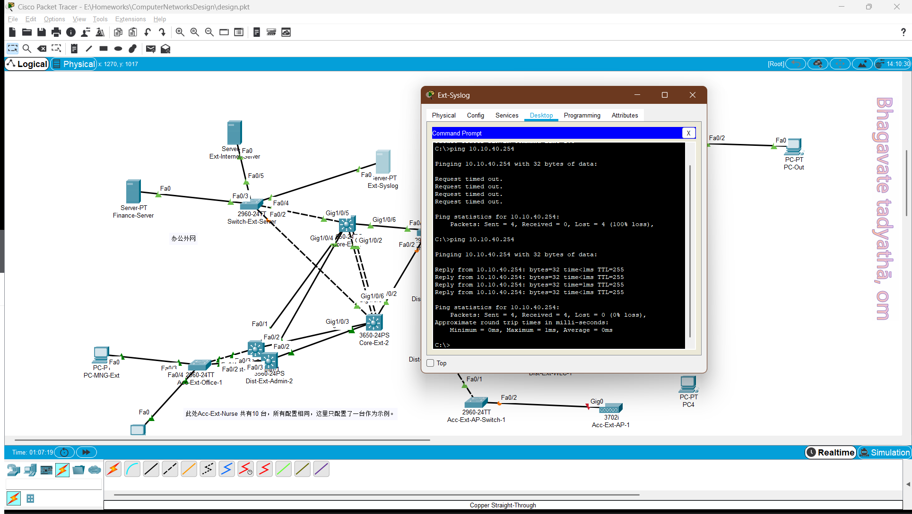


### 3.2.5 外网配置

#### 3.2.5.1 Core-Ext-1 补充配置

```
enable
configure terminal

! ========== 新增：连接 Switch-Ext-Router 的端口配置（G1/0/6） ==========
interface GigabitEthernet1/0/6
 switchport mode access
 switchport access vlan 220  
 ! 划入外网路由器VLAN 220
 no shutdown
 description TO-Switch-Ext-Router-Fa0/1
exit

! ========== 新增：默认路由（指向 Ext-Router 内网口，实现出网） ==========
ip route 0.0.0.0 0.0.0.0 10.10.220.1  
ip route 20.20.20.0 255.255.255.0 10.10.220.4
! 下一跳为 Ext-Router 的 Fa0/0/0 地址

! 保存配置
exit
write memory
```

#### 3.2.5.2 Core-Ext-2 补充配置

```
enable
configure terminal

! ========== 新增：连接 Switch-Ext-Router 的端口配置（G1/0/6） ==========
interface GigabitEthernet1/0/6
 switchport mode access
 switchport access vlan 220  
 ! 同VLAN 220，实现双核心冗余
 no shutdown
 description TO-Switch-Ext-Router-Fa0/2
exit

! ========== 新增：默认路由（与Core-Ext-1一致，冗余备份） ==========
ip route 0.0.0.0 0.0.0.0 10.10.220.1
ip route 20.20.20.0 255.255.255.0 10.10.220.4

! 保存配置
exit
write memory
```


#### 3.2.5.3 Switch-Ext-Router

```
! 设备基础命名与安全配置

en 
conf t

hostname Switch-Ext-Router
no ip domain-lookup
!
! 定义外网出口VLAN（匹配你规划的VLAN 220）
vlan 220
 name WAN-EXT
!
! 上联Core-Ext-1的端口（Fa0/1）
interface FastEthernet0/1
 switchport mode access
 switchport access vlan 220
 no shutdown
!
! 上联Core-Ext-2的端口（Fa0/2）
interface FastEthernet0/2
 switchport mode access
 switchport access vlan 220
 no shutdown
!
! 下联Ext-Router的端口（Fa0/3）
interface FastEthernet0/3
 switchport mode access
 switchport access vlan 220
 no shutdown
!
! VLAN 220三层接口（网关指向Ext-Router）
interface Vlan220
 ip address 10.10.220.3 255.255.255.240
 no shutdown
!
! 配置默认网关（指向Ext-Router的内网口）
ip default-gateway 10.10.220.4
!
! 保存配置到闪存

exit
write memory
```

#### 3.2.5.4 Ext-Router

```
enable
configure terminal

hostname Ext-Router
no ip domain-lookup

! ========== 内网口（NM-1FE-TX → FastEthernet0/0） ==========
interface FastEthernet0/0
 ip address 10.10.220.4 255.255.255.240  
 ! 对接Switch-Ext-Router
 no shutdown
 description TO-Switch-Ext-Router-Fa0/3
 ip nat inside                     
 ! 标记为 NAT 内部接口
exit

! ========== 外网口（WIC-1ENET → FastEthernet0/1） ==========
interface FastEthernet0/1
 ip address 20.20.20.1 255.255.255.0     
 ! 对接Switch-Out
 no shutdown
 description TO-Switch-Out-Fa0/1
 ip nat outside                    
 ! 标记为 NAT 外部接口
 ! 应用入方向 ACL（控制外网→内网服务器）
 ! 注意：出方向不再应用任何 ACL，确保内网 NAT 后的流量可自由出网
exit

! ========== 核心路由配置 ==========
! 回指内网：所有10.10.0.0/16流量指向核心VRRP网关
ip route 10.10.0.0 255.255.0.0 10.10.220.14
ip route 10.20.0.0 255.255.0.0 10.10.220.14
! 默认路由：所有外网流量指向模拟公网
ip route 0.0.0.0 0.0.0.0 20.20.20.254

! ========== NAT 配置 ==========
! 动态 NAT：允许整个内网 10.10.0.0/16 访问外网
access-list 1 permit 10.10.0.0 0.0.255.255   
ip nat inside source list 1 interface FastEthernet0/1 overload

! 静态 NAT：将内网服务器 10.10.230.3 映射为 20.20.20.5
ip nat inside source static 10.10.230.3 20.20.20.5

! ========== ACL 101：控制外网→内网服务器的流量（外网口入方向） =========
! 仅允许外网 20.20.20.0/24 访问服务器的 HTTP、HTTPS、ICMP Echo（ping）
access-list 101 permit tcp 20.20.20.0 0.0.0.255 host 20.20.20.5 eq 80
access-list 101 permit tcp 20.20.20.0 0.0.0.255 host 20.20.20.5 eq 443
access-list 101 permit icmp 20.20.20.0 0.0.0.255 host 20.20.20.5 echo
access-list 101 deny ip any host 20.20.20.5
access-list 101 permit ip any any                            
! 拒绝其他所有流量

! ========== 启用三层路由 ==========
ip routing

int fa 0/1
 ip access-group 101 in
exit
 
! 保存配置
exit
write memory
```

#### 3.2.5.5 Switch-Out

```
enable
configure terminal

! 设备基础配置
hostname Switch-Out
no ip domain-lookup

! 创建模拟公网VLAN（无需划分多VLAN，仅用VLAN 99统一承载）
vlan 99
 name WAN-PUBLIC
exit

! 上联Ext-Router的端口（Fa0/1，对应你之前的接线）
interface FastEthernet0/1
 switchport mode access
 switchport access vlan 99
 no shutdown
 description TO-Ext-Router-Fa0/1
exit

! 下联PC-Out的端口（Fa0/2）
interface FastEthernet0/2
 switchport mode access
 switchport access vlan 99
 no shutdown
 description TO-PC-Out
exit

! 配置三层接口（VLAN 99），作为交换机网关
interface Vlan99
 ip address 20.20.20.2 255.255.255.0  
 ! 匹配你指定的IP
 no shutdown
exit

! 配置默认网关（指向Ext-Router的外网口IP）
ip default-gateway 20.20.20.1

! 禁用不必要服务（可选，提升稳定性）
spanning-tree portfast default
spanning-tree mode rapid-pvst

! 保存配置
exit
write memory
```


#### 3.2.5.6 验证配置

```
Switch-Ext-Router#show vlan b

VLAN Name                             Status    Ports
---- -------------------------------- --------- -------------------------------
1    default                          active    Fa0/4, Fa0/5, Fa0/6, Fa0/7
                                                Fa0/8, Fa0/9, Fa0/10, Fa0/11
                                                Fa0/12, Fa0/13, Fa0/14, Fa0/15
                                                Fa0/16, Fa0/17, Fa0/18, Fa0/19
                                                Fa0/20, Fa0/21, Fa0/22, Fa0/23
                                                Fa0/24, Gig0/1, Gig0/2
220  WAN-EXT                          active    Fa0/1, Fa0/2, Fa0/3
1002 fddi-default                     active    
1003 token-ring-default               active    
1004 fddinet-default                  active    
1005 trnet-default                    active    


Switch-Ext-Router#ping 10.10.220.1

Type escape sequence to abort.
Sending 5, 100-byte ICMP Echos to 10.10.220.1, timeout is 2 seconds:
!!!!!
Success rate is 100 percent (5/5), round-trip min/avg/max = 0/0/1 ms

Switch-Ext-Router#

```

```
Ext-Router#ping 10.10.220.14

Type escape sequence to abort.
Sending 5, 100-byte ICMP Echos to 10.10.220.14, timeout is 2 seconds:
!!!!!
Success rate is 100 percent (5/5), round-trip min/avg/max = 0/0/0 ms

Ext-Router#
```

内网可以ping通外网

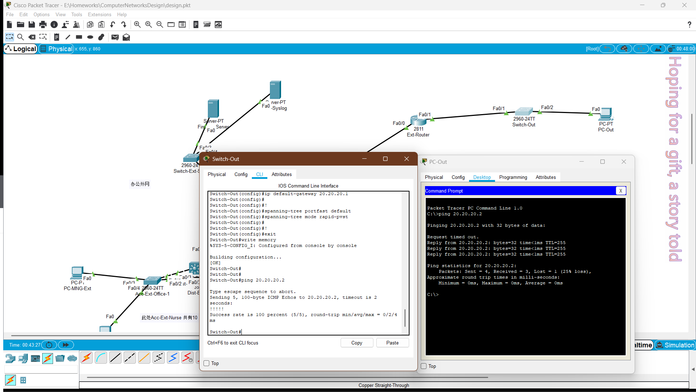

内网可以ping通外网

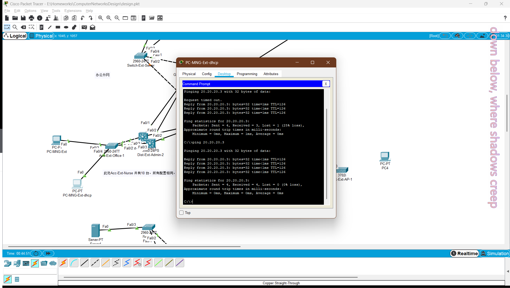

外网能够ping通内网服务器（Ext-Internet-Server 10.10.230.3）的外网地址20.20.20.5

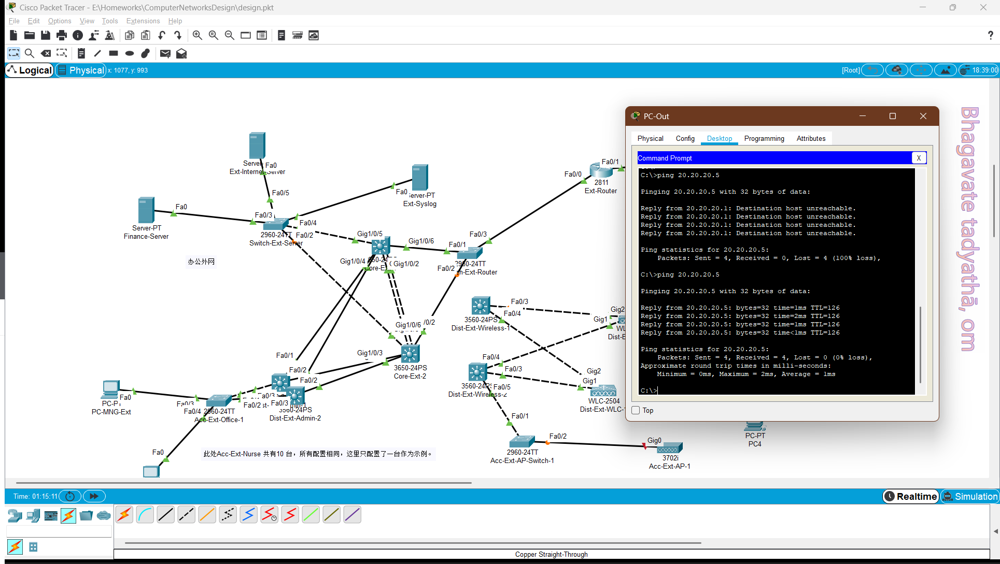

### 3.2.6 无线接入

| 连接两端设备                              | 源端口          | 目标端口             | 线缆类型                | 备注                  |
| ----------------------------------------- | --------------- | -------------------- | ----------------------- | --------------------- |
| Dist-Ext-Wireless-1 ↔ Core-Ext-1          | FastEthernet0/1 | GigabitEthernet1/0/7 | Fiber Straight-through  | 无线汇聚上行（冗余）  |
| Dist-Ext-Wireless-1 ↔ Core-Ext-2          | FastEthernet0/2 | GigabitEthernet1/0/7 | Fiber Straight-through  | 无线汇聚上行（冗余）  |
| Dist-Ext-Wireless-2 ↔ Core-Ext-1          | FastEthernet0/1 | GigabitEthernet1/0/8 | Fiber Straight-through  | 无线汇聚上行（冗余）  |
| Dist-Ext-Wireless-2 ↔ Core-Ext-2          | FastEthernet0/2 | GigabitEthernet1/0/8 | Fiber Straight-through  | 无线汇聚上行（冗余）  |
| Dist-Ext-Wireless-1 ↔ Dist-Ext-WLC-1      | FastEthernet0/3 | Gig1                 | Copper Straight-through | WLC 管理口连接        |
| Dist-Ext-Wireless-1 ↔ Dist-Ext-WLC-2      | FastEthernet0/4 | Gig1                 | Copper Straight-through | WLC 管理口连接        |
| Dist-Ext-Wireless-2 ↔ Dist-Ext-WLC-1      | FastEthernet0/3 | Gig2                 | Copper Straight-through | WLC 管理口连接        |
| Dist-Ext-Wireless-2 ↔ Dist-Ext-WLC-2      | FastEthernet0/4 | Gig2                 | Copper Straight-through | WLC 管理口连接        |
| Dist-Ext-Wireless-1 ↔ Acc-Ext-AP-Switch-1 | FastEthernet0/5 | FastEthernet0/1      | Copper Straight-through | AP 接入交换机上行     |
| Dist-Ext-Wireless-2 ↔ Acc-Ext-AP-Switch-1 | FastEthernet0/5 | FastEthernet0/2      | Copper Straight-through | AP 接入交换机上行     |
| Acc-Ext-AP-Switch-1 ↔ Acc-Ext-AP-1        | FastEthernet0/3 | Gig0                 | Copper Straight-through | AP 供电 + 数据（PoE） |

#### 3.2.6.1 Core-Ext-1补充配置

```
enable
configure terminal


interface GigabitEthernet1/0/7
 switchport trunk encapsulation dot1q
 switchport mode trunk
 switchport trunk allowed vlan 40,50,240  
 ! 放行无线相关VLAN
 switchport nonegotiate
 no shutdown
 description TO-Dist-Ext-Wireless-1-Fa0/1
exit

interface GigabitEthernet1/0/8
 switchport trunk encapsulation dot1q
 switchport mode trunk
 switchport trunk allowed vlan 40,50,240
 switchport nonegotiate
 no shutdown
 description TO-Dist-Ext-Wireless-2-Fa0/1
exit

! 5. 静态路由（确保无线网段通外网）
ip route 10.10.50.0 255.255.255.0 10.10.220.4
! 指向Ext-Router
ip route 10.10.40.0 255.255.255.0 10.10.220.4

! 保存配置
exit
write memory
```

#### 3.2.6.2 Core-Ext-2 补充配置

```
enable
configure terminal

! 2. 配置下联无线汇聚的端口
interface GigabitEthernet1/0/7
 switchport trunk encapsulation dot1q
 switchport mode trunk
 switchport trunk allowed vlan 40,50,240
 switchport nonegotiate
 no shutdown
 description TO-Dist-Ext-Wireless-1-Fa0/2
exit

interface GigabitEthernet1/0/8
 switchport trunk encapsulation dot1q
 switchport mode trunk
 switchport trunk allowed vlan 40,50,240
 switchport nonegotiate
 no shutdown
 description TO-Dist-Ext-Wireless-2-Fa0/2
exit

ip route 10.10.50.0 255.255.255.0 10.10.220.4
ip route 10.10.40.0 255.255.255.0 10.10.220.4

! 保存配置
exit
write memory
```

#### 3.2.6.3 Dist-Ext-Wireless-1

```
enable
configure terminal

hostname Dist-Ext-Wireless-1
no ip domain-lookup
spanning-tree mode rapid-pvst
spanning-tree portfast default

vlan 40
 name WIRELESS-MANAGE
 ! 无线汇聚交换机管理VLAN
exit
vlan 50
 name WLC-AP-MANAGE
 ! WLC/AP管理VLAN
exit
vlan 240
 name OFFICE-WIRELESS
 ! 办公无线业务VLAN（复用原有办公网段）
exit

! ========== 3. 上行端口（连核心交换机） ==========
! Fa0/1 → Core-Ext-1 G1/0/7
interface FastEthernet0/1
 switchport trunk encapsulation dot1q
 switchport mode trunk
 switchport trunk allowed vlan 40,50,240
 ! 仅放行无线相关VLAN
 switchport nonegotiate
 ! 禁用DTP，强制Trunk
 no shutdown
 description TO-Core-Ext-1-G1/0/7
exit

! Fa0/2 → Core-Ext-2 G1/0/7
interface FastEthernet0/2
 switchport trunk encapsulation dot1q
 switchport mode trunk
 switchport trunk allowed vlan 40,50,240
 switchport nonegotiate
 no shutdown
 description TO-Core-Ext-2-G1/0/7
exit

! ========== 4. 下联WLC端口 ==========
! Fa0/3 → Dist-Ext-WLC-1 Gig1
interface FastEthernet0/3
 switchport mode access
 switchport access vlan 240
 ! WLC管理VLAN
 no shutdown
 description TO-Dist-Ext-WLC-1-Gig1
exit

! Fa0/4 → Dist-Ext-WLC-2 Gig1
interface FastEthernet0/4
 switchport mode access
 switchport access vlan 240
 no shutdown
 description TO-Dist-Ext-WLC-2-Gig1
exit

! ========== 5. 下联AP接入交换机端口 ==========
! Fa0/5 → Acc-Ext-AP-Switch-1 Fa0/1

interface FastEthernet0/5
 switchport trunk encapsulation dot1q
 switchport mode trunk
 switchport trunk allowed vlan 50,240
 ! 仅放行AP/WLC管理+业务VLAN
 switchport nonegotiate
 no shutdown
 description TO-Acc-Ext-AP-Switch-1-Fa0/1
exit

! ========== 6. 管理接口配置 ==========
interface Vlan40
 ip address 10.10.40.45 255.255.255.0
 ! 本机管理IP
 no shutdown
exit

interface Vlan50
 ip address 10.10.50.3 255.255.255.0
 ! 备用管理IP（避免和核心冲突）
 no shutdown
exit

! ========== 7. 网关/路由配置 ==========
ip default-gateway 10.10.40.254
! 指向核心VRRP虚拟网关
ip routing
! 启用三层路由（3560支持）
ip route 0.0.0.0 0.0.0.0 10.10.40.254
! 默认路由指向核心

! ========== 8. 保存配置 ==========
exit
write memory
```


#### 3.2.6.4 Dist-Ext-Wireless-2

```
enable
configure terminal

! ========== 1. 基础全局配置 ==========
hostname Dist-Ext-Wireless-2
no ip domain-lookup
spanning-tree mode rapid-pvst
spanning-tree portfast default

! ========== 2. VLAN配置（和Wireless-1一致） ==========
vlan 40
 name WIRELESS-MANAGE
exit
vlan 50
 name WLC-AP-MANAGE
exit
vlan 240
 name OFFICE-WIRELESS
exit

! ========== 3. 上行端口（连核心交换机） ==========
! Fa0/1 → Core-Ext-1 G1/0/8
interface FastEthernet0/1
 switchport trunk encapsulation dot1q
 switchport mode trunk
 switchport trunk allowed vlan 40,50,240
 switchport nonegotiate
 no shutdown
 description TO-Core-Ext-1-G1/0/8
exit

! Fa0/2 → Core-Ext-2 G1/0/8
interface FastEthernet0/2
 switchport trunk encapsulation dot1q
 switchport mode trunk
 switchport trunk allowed vlan 40,50,240
 switchport nonegotiate
 no shutdown
 description TO-Core-Ext-2-G1/0/8
exit

! ========== 4. 下联WLC端口 ==========
! Fa0/3 → Dist-Ext-WLC-1 Gig2
interface FastEthernet0/3
 switchport mode access
 switchport access vlan 240
 no shutdown
 description TO-Dist-Ext-WLC-1-Gig2
exit

! Fa0/4 → Dist-Ext-WLC-2 Gig2
interface FastEthernet0/4
 switchport mode access
 switchport access vlan 240
 no shutdown
 description TO-Dist-Ext-WLC-2-Gig2
exit

! ========== 5. 下联AP接入交换机端口 ==========
! Fa0/5 → Acc-Ext-AP-Switch-1 Fa0/2
interface FastEthernet0/5
 switchport trunk encapsulation dot1q
 switchport mode trunk
 switchport trunk allowed vlan 50,240
 switchport nonegotiate
 no shutdown
 description TO-Acc-Ext-AP-Switch-1-Fa0/2
exit

! ========== 6. 管理接口配置 ==========
interface Vlan40
 ip address 10.10.40.46 255.255.255.0
 ! 本机管理IP（和Wireless-1区分）
 no shutdown
exit

interface Vlan50
 ip address 10.10.50.4 255.255.255.0
 no shutdown
exit

! ========== 7. 网关/路由配置 ==========
ip default-gateway 10.10.40.254
ip routing
ip route 0.0.0.0 0.0.0.0 10.10.40.254

! ========== 8. 保存配置 ==========
exit
write memory
```

#### 3.2.6.5 Acc-Ext-AP-Switch-1

````
enable
configure terminal

! ========== 1. 基础全局配置 ==========
hostname Acc-Ext-AP-Switch-1

spanning-tree mode rapid-pvst
! 快速生成树，减少链路收敛时间
spanning-tree portfast default
! 接入端口快速转发（AP端口生效）


! ========== 2. VLAN配置（和无线汇聚交换机一致） ==========
vlan 50
 name WLC-AP-MANAGE
 ! WLC/AP管理VLAN（核心）
exit
vlan 240
 name OFFICE-WIRELESS
 ! 办公无线业务VLAN
exit

! ========== 3. 上行端口（双上联到无线汇聚交换机） ==========
! Fa0/1 → Dist-Ext-Wireless-1 Fa0/5
interface FastEthernet0/1
 switchport mode trunk
 switchport trunk allowed vlan 50,240
 ! 仅放行AP/WLC相关VLAN
 switchport nonegotiate
 ! 禁用DTP，强制Trunk模式
 no shutdown
 description TO-Dist-Ext-Wireless-1-Fa0/5
exit

! Fa0/2 → Dist-Ext-Wireless-2 Fa0/5
interface FastEthernet0/2
 switchport mode trunk
 switchport trunk allowed vlan 50,240
 switchport nonegotiate
 no shutdown
 description TO-Dist-Ext-Wireless-2-Fa0/5
exit

! ========== 4. AP接入端口（PoE供电+数据，Fa0/3 → Acc-Ext-AP-1 Gig0） ==========
interface FastEthernet0/3
 switchport mode access
 switchport access vlan 240
 ! AP管理VLAN（和WLC/汇聚一致）
 switchport nonegotiate
 ! 禁用DTP，强制Access模式
 no shutdown
 description TO-Acc-Ext-AP-1-Gig0
exit

! ========== 5. 其他AP接入端口模板（可选，批量配置备用） ==========
! 若有更多AP，可批量配置Fa0/4-Fa0/10（示例）
interface range FastEthernet0/5 - 10
 switchport mode access
 switchport access vlan 240
 switchport nonegotiate
 no shutdown
 description AP-PORT
exit

! ========== 6. 管理接口配置 ==========
interface Vlan50
 ip address 10.10.50.2 255.255.255.0
 ! 本机管理IP（唯一，不和其他设备冲突）
 no shutdown
exit

! ========== 7. 网关配置（指向核心VRRP虚拟网关，冗余） ==========
ip default-gateway 10.10.50.254
! 无线管理网段虚拟网关（核心交换机配置的VRRP IP）

! ========== 8. 保存配置 ==========
exit
write memory
````

#### 3.2.6.5 Dist-Ext-WLC-1 以及Acc-Ext-AP-1 的配置

参考：[Cisco Packet Trancer组网 WLC+AP无线控制器 配置详解]( https://www.bilibili.com/video/BV1j8C6YoELW/?share_source=copy_web&vd_source=e0cfb3900880a0e2d7e071baacef0ee2)

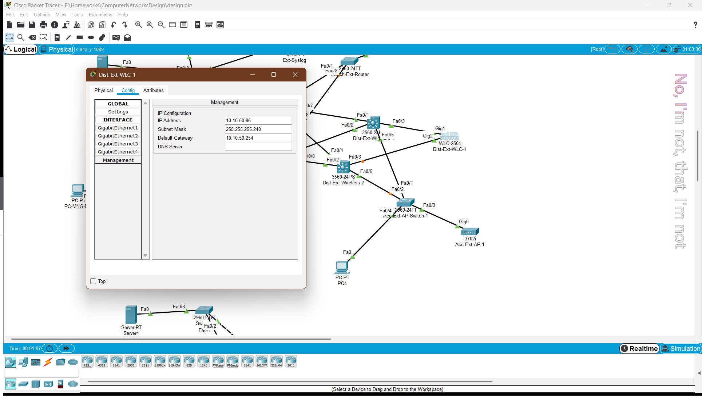

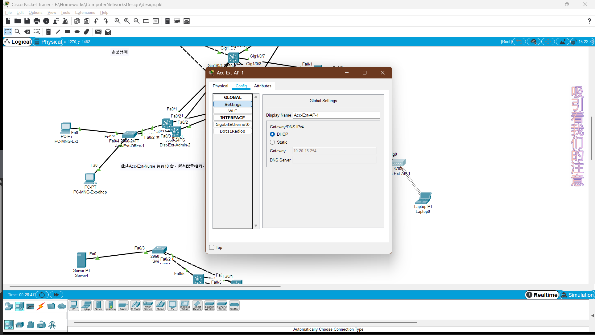

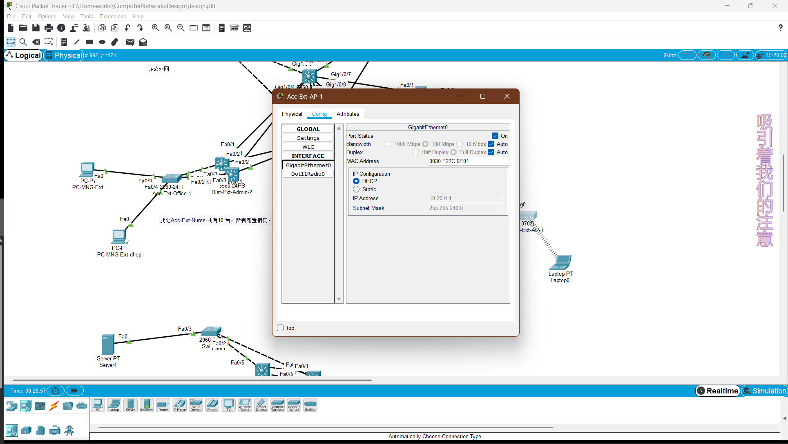

访问无线控制器地址http://10.20.15.253

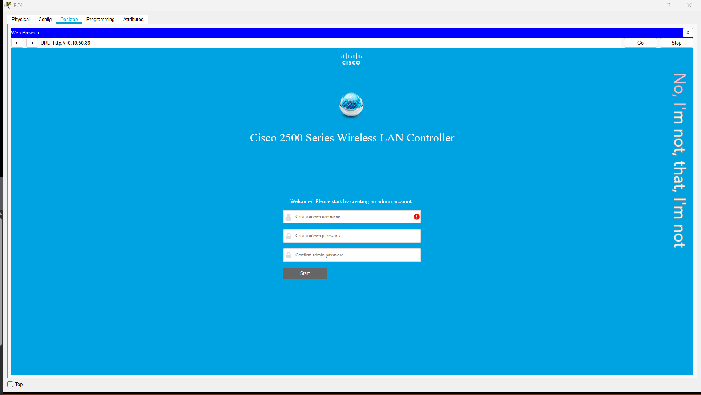

```json
{
    "username":"Cisco",
    "pwd":"Cisco123"
}
```

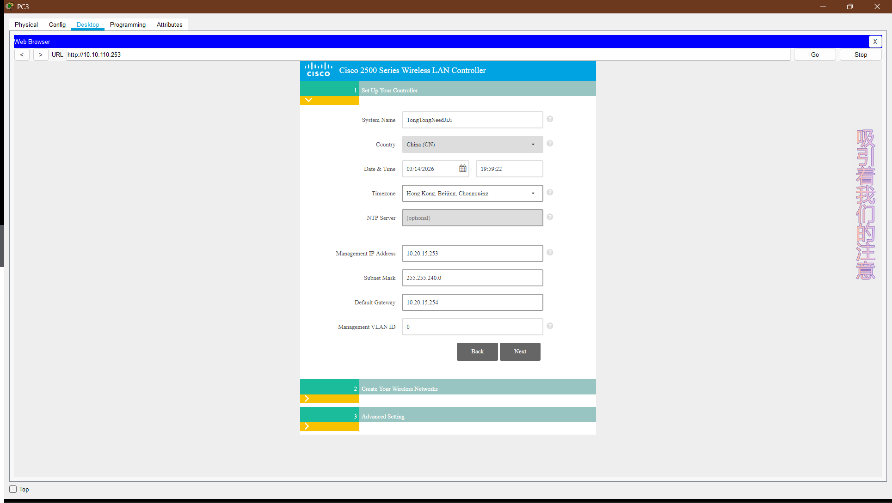


```json
{
    "network name":"TongTongNeedJiJi",
    "Passphrase":"Tongji66666"
    
}
```

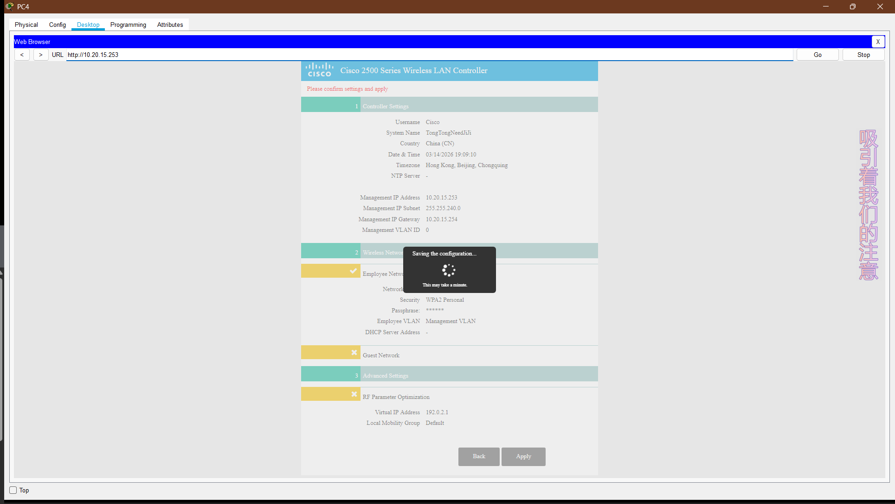

不必过多等待，进入https://10.20.15.253

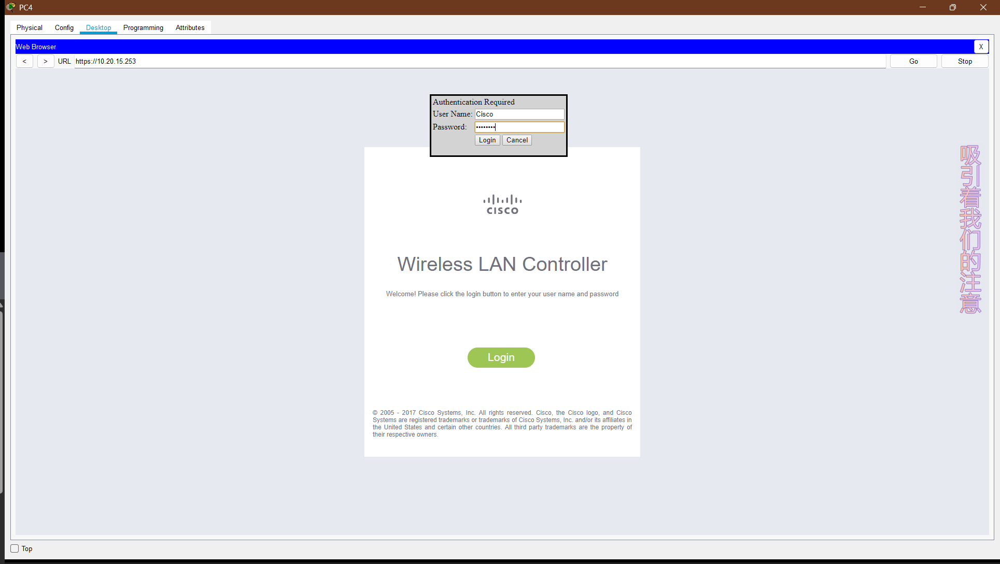

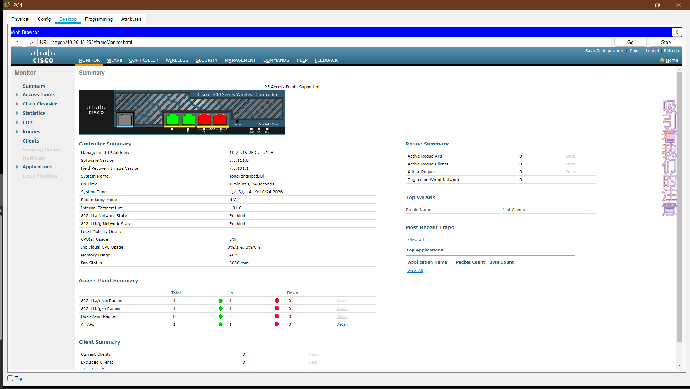

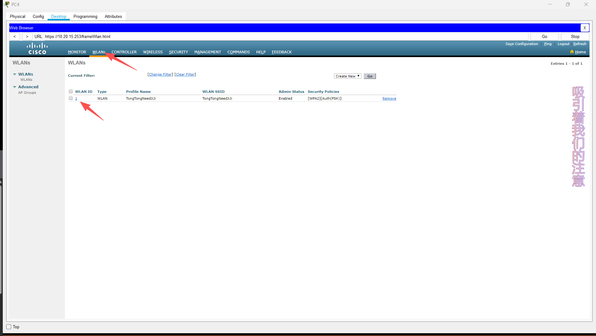

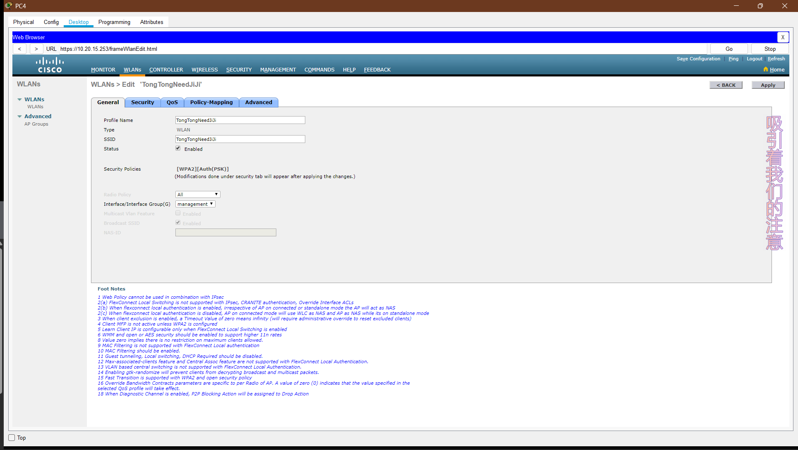

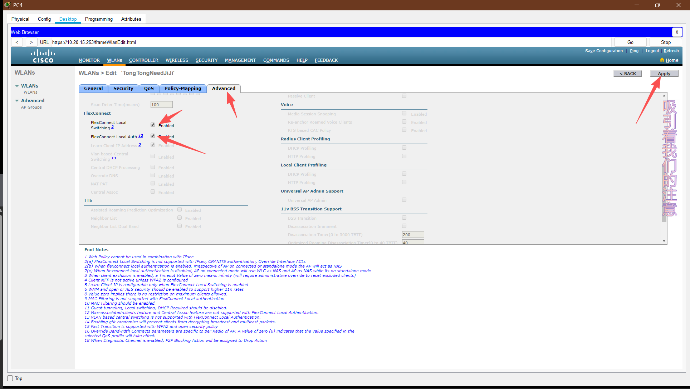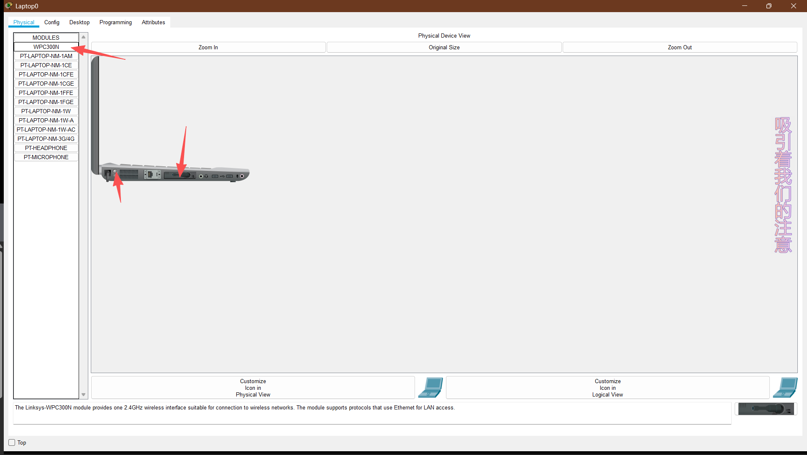

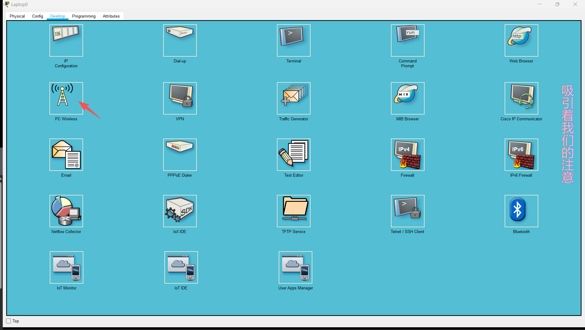


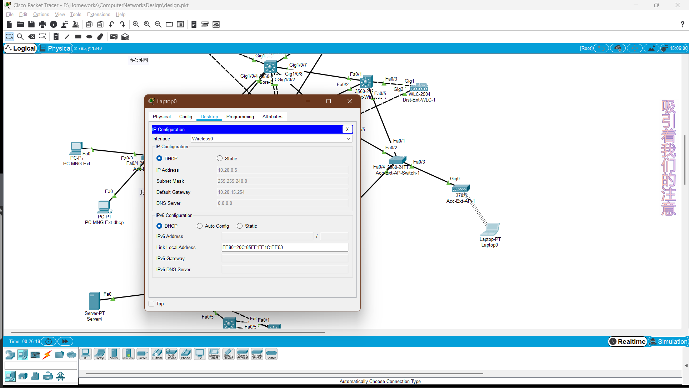

#### 3.2.6.7 验证配置

成功连接到外网

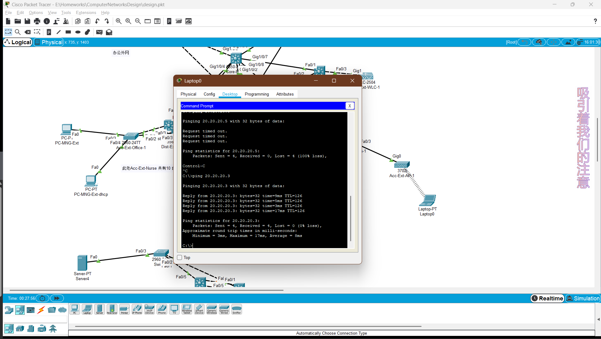

## 3.3 设备专网

### 3.3.1 核心层配置

#### 3.3.1.1 Core-Dev-1

```
enable
configure terminal

hostname Core-Dev-1
no ip domain-lookup 

! 创建设备专网相关VLAN
vlan 40
 name Management
exit
vlan 60
 name Device_AP_Management
exit
vlan 110
 name Medical_Mobile_Terminal
exit
vlan 120
 name Device_Info_Server
exit

! 双核心互联 - 链路聚合配置
interface range GigabitEthernet1/0/1 - 2
 switchport trunk encapsulation dot1q
 switchport mode trunk
 channel-group 1 mode active
 no shutdown
exit

interface Port-channel1
 switchport trunk encapsulation dot1q
 switchport mode trunk
 switchport trunk allowed vlan all
 no shutdown
exit

! 管理VLAN配置
interface Vlan40
 ip address 10.10.40.49 255.255.255.0
 no shutdown
 standby 40 ip 10.10.40.254
 standby 40 priority 120
 standby 40 preempt
exit

! 设备AP管理VLAN 60
interface Vlan60
 ip address 10.10.60.1 255.255.255.0
 no shutdown
 standby 60 ip 10.10.60.254
 standby 60 priority 120
 standby 60 preempt
exit

! VLAN 110 医疗移动终端
interface Vlan110
 ip address 10.10.110.1 255.255.255.0
 no shutdown
 standby 110 ip 10.10.110.254
 standby 110 priority 120
 standby 110 preempt
exit

! VLAN 120 设备信息服务器（仅保留三层接口，无DHCP）
interface Vlan120
 ip address 10.10.120.1 255.255.255.240
 no shutdown
 standby 120 ip 10.10.120.14
 standby 120 priority 120
 standby 120 preempt
exit

! 启用三层路由
ip routing

! DHCP配置 - 仅保留VLAN110
service dhcp
ip dhcp pool VLAN110-Medical-Terminal
 network 10.10.110.0 255.255.255.0
 default-router 10.10.110.254
exit

ip dhcp excluded-address 10.10.110.1
ip dhcp excluded-address 10.10.110.2
ip dhcp excluded-address 10.10.110.253
ip dhcp excluded-address 10.10.110.254

! 生成树配置
spanning-tree mode rapid-pvst
spanning-tree vlan 40,60,110,120 root primary 

exit
write memory
```

#### 3.3.1.2 Core-Dev-2

```
enable
configure terminal

hostname Core-Dev-2
no ip domain-lookup

! 创建设备专网相关VLAN
vlan 40
 name Management
exit
vlan 60
 name Device_AP_Management
exit
vlan 110
 name Medical_Mobile_Terminal
exit
vlan 120
 name Device_Info_Server
exit

! 双核心互联 - 链路聚合配置
interface range GigabitEthernet1/0/1 - 2
 switchport trunk encapsulation dot1q
 switchport mode trunk
 channel-group 1 mode active
 no shutdown
exit

interface Port-channel1
 switchport trunk encapsulation dot1q
 switchport mode trunk
 switchport trunk allowed vlan all
 no shutdown
exit

! 管理VLAN配置
interface Vlan40
 ip address 10.10.40.50 255.255.255.0
 no shutdown
 standby 40 ip 10.10.40.254
 standby 40 priority 100
 standby 40 preempt
exit

! 设备AP管理VLAN 60
interface Vlan60
 ip address 10.10.60.2 255.255.255.0
 no shutdown
 standby 60 ip 10.10.60.254
 standby 60 priority 100
 standby 60 preempt
exit

! VLAN 110 医疗移动终端
interface Vlan110
 ip address 10.10.110.2 255.255.255.0
 no shutdown
 standby 110 ip 10.10.110.254
 standby 110 priority 100
 standby 110 preempt
exit

! VLAN 120 设备信息服务器（仅保留三层接口，无DHCP）
interface Vlan120
 ip address 10.10.120.2 255.255.255.240
 no shutdown
 standby 120 ip 10.10.120.14
 standby 120 priority 100
 standby 120 preempt
exit

! 启用三层路由
ip routing

! 备用DHCP - 仅保留VLAN110
service dhcp
ip dhcp pool VLAN110-Medical-Terminal-Backup
 network 10.10.110.0 255.255.255.0
 default-router 10.10.110.254
exit

ip dhcp excluded-address 10.10.110.1
ip dhcp excluded-address 10.10.110.2
ip dhcp excluded-address 10.10.110.253
ip dhcp excluded-address 10.10.110.254

! DHCP中继 - 仅保留VLAN110
interface Vlan110
 ip helper-address 10.10.110.1
exit

! 生成树配置
spanning-tree mode rapid-pvst
spanning-tree vlan 40,60,110,120 root secondary  

exit
write memory
```

###  3.3.2 医疗设备接入层配置

#### 3.3.2.1 Core-Dev-1 补充配置（无线相关）
```
enable
configure terminal

! 配置下联设备专网汇聚的端口
interface GigabitEthernet1/0/7
 switchport trunk encapsulation dot1q
 switchport mode trunk
 switchport trunk allowed vlan 40,60,110  
 ! 放行设备专网无线相关VLAN：40(设备管理)、60(设备AP管理)、110(移动医疗终端)
 switchport nonegotiate
 no shutdown
 description TO-Dist-Dev-1-Fa0/1
exit

interface GigabitEthernet1/0/8
 switchport trunk encapsulation dot1q
 switchport mode trunk
 switchport trunk allowed vlan 40,60,110
 switchport nonegotiate
 no shutdown
 description TO-Dist-Dev-2-Fa0/1
exit

! 静态路由（确保设备专网无线网段互通）
ip route 10.10.60.0 255.255.255.0 10.10.110.254
! 指向设备专网移动终端网段网关
ip route 10.10.40.0 255.255.255.0 10.10.110.254

! 保存配置
exit
write memory
```

#### 3.3.2.2 Core-Dev-2 补充配置（无线相关）
```
enable
configure terminal

! 配置下联设备专网汇聚的端口
interface GigabitEthernet1/0/7
 switchport trunk encapsulation dot1q
 switchport mode trunk
 switchport trunk allowed vlan 40,60,110
 switchport nonegotiate
 no shutdown
 description TO-Dist-Dev-1-Fa0/2
exit

interface GigabitEthernet1/0/8
 switchport trunk encapsulation dot1q
 switchport mode trunk
 switchport trunk allowed vlan 40,60,110
 switchport nonegotiate
 no shutdown
 description TO-Dist-Dev-2-Fa0/2
exit

! 静态路由（冗余备份）
ip route 10.10.60.0 255.255.255.0 10.10.110.254
ip route 10.10.40.0 255.255.255.0 10.10.110.254

! 保存配置
exit
write memory
```

#### 3.3.2.3 Dist-Dev-1（设备专网无线汇聚1）
```
enable
configure terminal

! 基础全局配置
hostname Dist-Dev-1
no ip domain-lookup
spanning-tree mode rapid-pvst
spanning-tree portfast default

! VLAN配置（设备专网无线专属）
vlan 40
 name DEVICE-MANAGE
 ! 设备专网汇聚交换机管理VLAN
exit
vlan 60
 name DEV-AP-MANAGE
 ! 设备专网AP/WLC管理VLAN
exit
vlan 110
 name MEDICAL-MOBILE
 ! 医疗移动终端业务VLAN
exit

! ========== 上行端口（连设备专网核心交换机） ==========
! Fa0/1 → Core-Dev-1 G1/0/7
interface FastEthernet0/1
 switchport trunk encapsulation dot1q
 switchport mode trunk
 switchport trunk allowed vlan 40,60,110
 switchport nonegotiate
 no shutdown
 description TO-Core-Dev-1-G1/0/7
exit

! Fa0/2 → Core-Dev-2 G1/0/7
interface FastEthernet0/2
 switchport trunk encapsulation dot1q
 switchport mode trunk
 switchport trunk allowed vlan 40,60,110
 switchport nonegotiate
 no shutdown
 description TO-Core-Dev-2-G1/0/7
exit

! ========== 下联WLC端口 ==========
! Fa0/3 → Dist-Dev-WLC-1 Gig1
interface FastEthernet0/3
 switchport mode access
 switchport access vlan 110
 ! 设备专网WLC绑定移动终端业务VLAN
 no shutdown
 description TO-Dist-Dev-WLC-1-Gig1
exit

! Fa0/4 → Dist-Dev-WLC-2 Gig1
interface FastEthernet0/4
 switchport mode access
 switchport access vlan 110
 no shutdown
 description TO-Dist-Dev-WLC-2-Gig1
exit

! ========== 下联AP接入交换机端口 ==========
! Fa0/5 → Acc-Dev-AP-Switch-1 Fa0/1
interface FastEthernet0/5
 switchport trunk encapsulation dot1q
 switchport mode trunk
 switchport trunk allowed vlan 60,110
 ! 仅放行设备AP管理+移动终端业务VLAN
 switchport nonegotiate
 no shutdown
 description TO-Acc-Dev-AP-Switch-1-Fa0/1
exit

! ========== 管理接口配置 ==========
interface Vlan40
 ip address 10.10.40.51 255.255.255.0
 ! 本机管理IP（设备专网汇聚1专属）
 no shutdown
exit

interface Vlan60
 ip address 10.10.60.3 255.255.255.0
 ! 设备AP管理网段备用IP
 no shutdown
exit

! ========== 网关/路由配置 ==========
ip default-gateway 10.10.40.254
! 指向管理网段VRRP虚拟网关
ip routing
! 启用三层路由（3560支持）
ip route 0.0.0.0 0.0.0.0 10.10.40.254
! 默认路由指向核心

! ========== 保存配置 ==========
exit
write memory
```

#### 3.3.2.4 Dist-Dev-2（设备专网无线汇聚2）
```
enable
configure terminal

! 基础全局配置
hostname Dist-Dev-2
no ip domain-lookup
spanning-tree mode rapid-pvst
spanning-tree portfast default

! VLAN配置（和Dist-Dev-1一致）
vlan 40
 name DEVICE-MANAGE
exit
vlan 60
 name DEV-AP-MANAGE
exit
vlan 110
 name MEDICAL-MOBILE
exit

! ========== 上行端口（连设备专网核心交换机） ==========
! Fa0/1 → Core-Dev-1 G1/0/8
interface FastEthernet0/1
 switchport trunk encapsulation dot1q
 switchport mode trunk
 switchport trunk allowed vlan 40,60,110
 switchport nonegotiate
 no shutdown
 description TO-Core-Dev-1-G1/0/8
exit

! Fa0/2 → Core-Dev-2 G1/0/8
interface FastEthernet0/2
 switchport trunk encapsulation dot1q
 switchport mode trunk
 switchport trunk allowed vlan 40,60,110
 switchport nonegotiate
 no shutdown
 description TO-Core-Dev-2-G1/0/8
exit

! ========== 下联WLC端口 ==========
! Fa0/3 → Dist-Dev-WLC-1 Gig2
interface FastEthernet0/3
 switchport mode access
 switchport access vlan 110
 no shutdown
 description TO-Dist-Dev-WLC-1-Gig2
exit

! Fa0/4 → Dist-Dev-WLC-2 Gig2
interface FastEthernet0/4
 switchport mode access
 switchport access vlan 110
 no shutdown
 description TO-Dist-Dev-WLC-2-Gig2
exit

! ========== 下联AP接入交换机端口 ==========
! Fa0/5 → Acc-Dev-AP-Switch-1 Fa0/2
interface FastEthernet0/5
 switchport trunk encapsulation dot1q
 switchport mode trunk
 switchport trunk allowed vlan 60,110
 switchport nonegotiate
 no shutdown
 description TO-Acc-Dev-AP-Switch-1-Fa0/2
exit

! ========== 管理接口配置 ==========
interface Vlan40
 ip address 10.10.40.52 255.255.255.0
 ! 本机管理IP（设备专网汇聚2专属）
 no shutdown
exit

interface Vlan60
 ip address 10.10.60.4 255.255.255.0
 ! 设备AP管理网段备用IP
 no shutdown
exit

! ========== 网关/路由配置 ==========
ip default-gateway 10.10.40.254
ip routing
ip route 0.0.0.0 0.0.0.0 10.10.40.254

! ========== 保存配置 ==========
exit
write memory
```

#### 3.3.2.5 Acc-Dev-AP-Switch-1（设备专网AP接入交换机）
```
enable
configure terminal

! ========== 1. 基础全局配置 ==========
hostname Acc-Dev-AP-Switch-1

spanning-tree mode rapid-pvst
spanning-tree portfast default
no ip domain-lookup

! ========== 2. VLAN配置（设备专网无线） ==========
vlan 60
 name DEV-AP-MANAGE
 ! 设备专网AP管理VLAN
exit
vlan 110
 name MEDICAL-MOBILE
 ! 医疗移动终端业务VLAN
exit

! ========== 3. 双上行端口（到设备专网汇聚） ==========
! Fa0/1 → Dist-Dev-1 Fa0/5
interface FastEthernet0/1
 switchport mode trunk
 switchport trunk allowed vlan 60,110
 switchport nonegotiate
 no shutdown
 description TO-Dist-Dev-1-Fa0/5
exit

! Fa0/2 → Dist-Dev-2 Fa0/5
interface FastEthernet0/2
 switchport mode trunk
 switchport trunk allowed vlan 60,110
 switchport nonegotiate
 no shutdown
 description TO-Dist-Dev-2-Fa0/5
exit

! ========== 4. AP接入端口（Fa0/3 → Acc-Dev-AP-1 Gig0） ==========
interface FastEthernet0/3
 switchport mode access
 switchport access vlan 110
 switchport nonegotiate
 no shutdown
 description TO-Acc-Dev-AP-1-Gig0
exit

! ========== 5. 批量AP端口模板（Fa0/4–Fa0/10） ==========
interface range FastEthernet0/4 - 10
 switchport mode access
 switchport access vlan 110
 switchport nonegotiate
 no shutdown
 description DEV-AP-PORT
exit

! ========== 6. 管理接口配置 ==========
interface Vlan60
 ip address 10.10.60.2 255.255.255.0
 no shutdown
exit

! ========== 7. 网关指向核心VRRP ==========
ip default-gateway 10.10.60.254

! ========== 8. 保存配置 ==========
exit
write memory
```

#### 3.3.2.6 wlc 与ap配置

虽然使用与前文相同的配置实验多次，仍然无法以相同的配置 达成 相同 的 目的。遂放弃，使用HomeRouter-PT-AC 完成配置 。

参考:[思科（CISCO）配置 Wireless（无线） LAN 接入 - sh1ny2 - 博客园](https://www.cnblogs.com/sh1ny2/p/14093828.html)

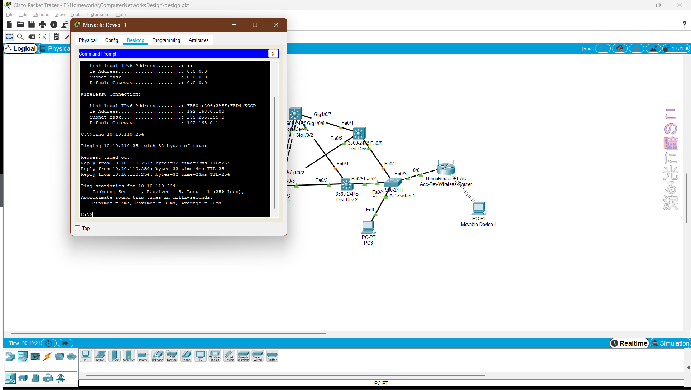

```json
{
    "username":"Cisco",
    "pwd":"Cisco123"
}
```

```json
{
    "network name":"TongTongAiJiJi",
    "Passphrase":"Tongji66666"
}
```

### 3.3.3 服务器配置

### 3.1.7 设备专网服务器区配置
#### 3.3.3.1 Core-Dev-1 补充配置（设备专网核心交换机1）
```
enable
configure terminal

! 对接设备专网服务器接入交换机的接口（G1/0/9）
interface GigabitEthernet1/0/9
 switchport trunk encapsulation dot1q
 switchport mode trunk
 switchport trunk allowed vlan 40,120 
 ! 放行管理VLAN40 + 设备服务器VLAN120
 no shutdown
exit

! VLAN120主根桥（设备服务器网段生成树主节点）
spanning-tree vlan 120 root primary

! 保存配置
exit
write memory
```

#### 3.3.3.2 Core-Dev-2 补充配置（设备专网核心交换机2）
```
enable
configure terminal

! 对接设备专网服务器接入交换机的接口（G1/0/9）
interface GigabitEthernet1/0/9
 switchport trunk encapsulation dot1q
 switchport mode trunk
 switchport trunk allowed vlan 40,120
 no shutdown
exit

! VLAN120备用根桥（核心故障时自动切换）
spanning-tree vlan 120 root secondary

! 保存配置
exit
write memory
```

#### 3.3.3.3 Server-Dev-Switch 配置（设备专网服务器接入交换机）
```
! 进入特权模式
enable
configure terminal

hostname Server-Dev-Switch
no ip domain-lookup

! ===================== 2. VLAN配置（匹配设备专网规划） =====================
! 设备专网服务器业务VLAN
vlan 120
 name Device_Server
exit

! 设备管理VLAN（与核心/防火墙统一）
vlan 40
 name Management
exit

! ===================== 3. 上联核心交换机接口配置（冗余连通） =====================
! Fa0/1 对接 Core-Dev-1 的 G1/0/9
interface FastEthernet0/1
 switchport mode trunk 
 switchport trunk allowed vlan 40,120
 no shutdown
exit

! Fa0/2 对接 Core-Dev-2 的 G1/0/9（冗余备份）
interface FastEthernet0/2
 switchport mode trunk
 switchport trunk allowed vlan 40,120
 no shutdown
exit

! ===================== 4. 服务器接入端口配置（核心接入） =====================
! Fa0/3 对接 Dev-Server（设备专网服务器）
interface FastEthernet0/3
 switchport mode access
 switchport access vlan 120
 spanning-tree portfast
 no shutdown
 description TO-Dev-Server
exit

! Fa0/4 对接 Syslog-Server（日志审计服务器）
interface FastEthernet0/4
 switchport mode access
 switchport access vlan 120
 spanning-tree portfast
 no shutdown
 description TO-Syslog-Server
exit

! 备用服务器端口模板（批量配置）
interface range FastEthernet0/5 - 24
 switchport mode access
 switchport access vlan 120
 spanning-tree portfast
 no shutdown
 description Device-Server-Backup-Port
exit

! ===================== 5. 管理VLAN配置（保障设备运维） =====================
interface Vlan40
 ip address 10.10.40.54 255.255.255.0
 ! 设备专网服务器交换机专属管理IP
 no shutdown
exit

! 默认网关（指向核心层VRRP虚拟网关，保障冗余）
ip default-gateway 10.10.40.254

! ===================== 6. 生成树配置（防环路，保障冗余） =====================
spanning-tree mode rapid-pvst
spanning-tree vlan 40,120 priority 24576

! ===================== 7. 保存配置（防止丢失） =====================
exit
write memory
```

#### 3.3.3.4 验证配置

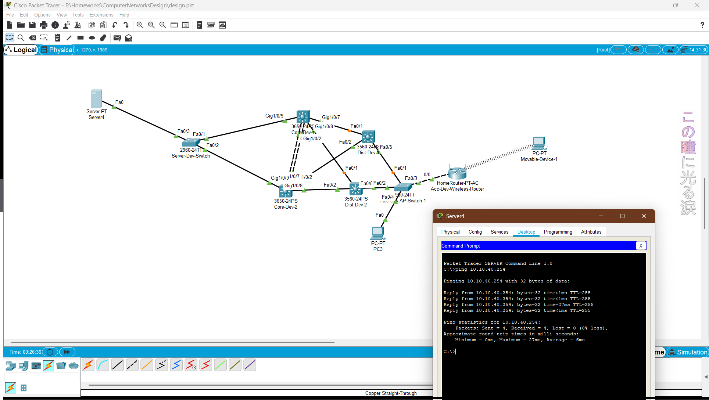